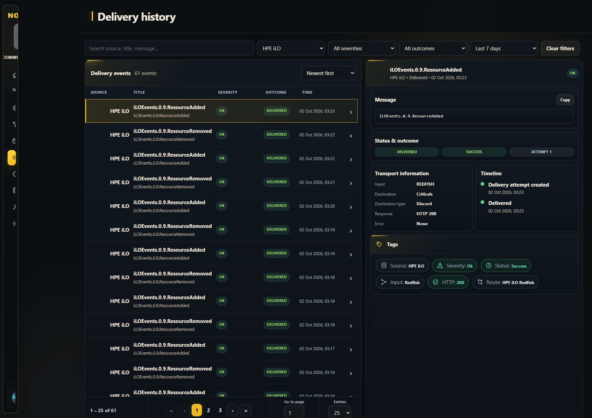
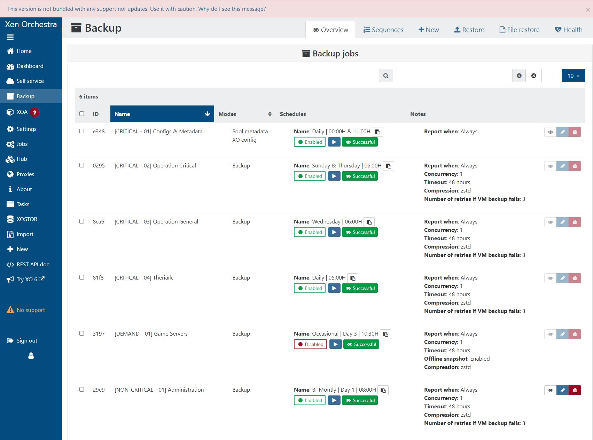

# Collect supported source events before centralized filtering

Configure sources to emit their broadest supported notification stream, then
apply destination policies in Nowlert **Filtering**. Source-specific limitations
still apply: an alerting subscription is not a universal audit-log export.

## Local configuration audit: 2 October 2026

| Source | Previous restriction | Change and validation |
|---|---|---|
| HPE iLO4 | Alert and StatusChange only | PATCH accepted HTTP 200 for all five advertised event types. Subsequent ResourceAdded and ResourceRemoved events appeared as Delivered in Nowlert. Subscription readback is pending a renewed private controller session. |
| Supermicro | Alert and StatusChange only | PATCH accepted HTTP 200 for all five advertised event types. Readback remains pending; controller-originated TLS delivery remains unverified. |
| Dell iDRAC8 | Alert and StatusChange only | This firmware rejects subscription PATCH with HTTP 405. An additional all-five subscription was created with HTTP 201; its response lists all five types. The old subscription was preserved. Controller TLS delivery remains unverified. |
| Xen Orchestra backup reports | Theriark VM and configuration/metadata jobs used Skipped and failure | All six existing jobs now show Always, including configuration/metadata. Both restricted jobs were changed and the saved overview was checked. |
| Portainer BE Alerting | Manager disabled, no channels, rules disabled | Enabled the internal manager, configured the authenticated Nowlert channel, and enabled all 13 available rules. No alert silences existed. Delivery verification is described in the Portainer tutorial. |

All three controllers' Event Services advertise exactly:

```json
["StatusChange", "ResourceUpdated", "ResourceAdded", "ResourceRemoved", "Alert"]
```

Use the firmware's advertised event types rather than inventing unsupported
values. Existing routes and destinations were preserved. Dell's additive
subscription overlaps the older subscription for Alert and StatusChange; review
duplicate callbacks before retiring an old subscription during a planned change.

For Xen Orchestra, choose **Always** on every supported backup job and leave
report compaction/success suppression disabled when full reports are needed.
All six saved job conditions are Always; the reporting details of each
job still deserve review. This setting does not export all XO tasks or audit logs.

Portainer thresholds, evaluation periods, Kubernetes-only rules, Alertmanager
grouping/inhibition, and source-side silences can affect the emitted stream.
Enabling every rule does not turn native Alerting into a raw Docker-event feed.





## Reproduce and verify

1. Read the source's advertised capabilities and current subscriptions/settings.
2. Enable the broadest supported event types or reporting condition.
3. Read the configuration back, then send a safe source-originated test.
4. Confirm receipt and delivery or filtering in Nowlert.
5. Maintain delivery policies centrally; monitor source subscription health too.

Use the [hardware tutorial](hardware-redfish-setup.md),
[Xen Orchestra tutorial](xen-orchestra-to-discord.md), and
[Portainer tutorial](portainer-to-discord.md) for the setup steps.
