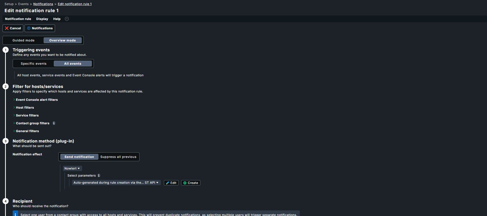
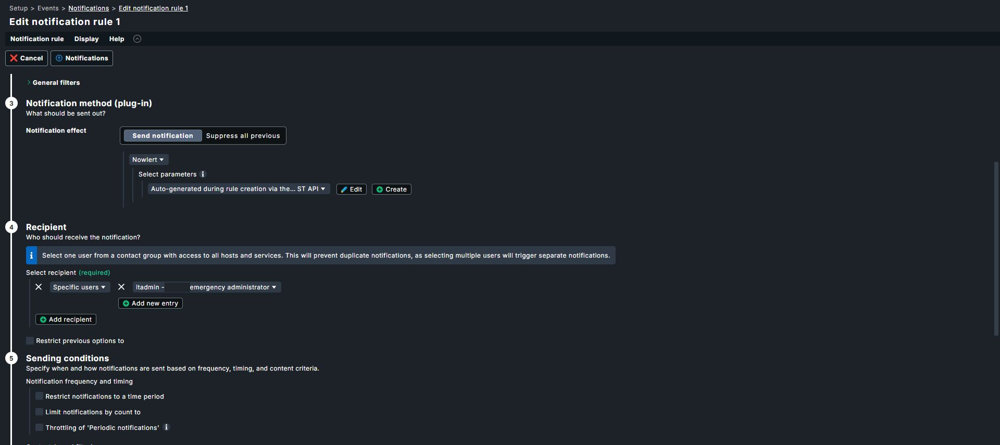
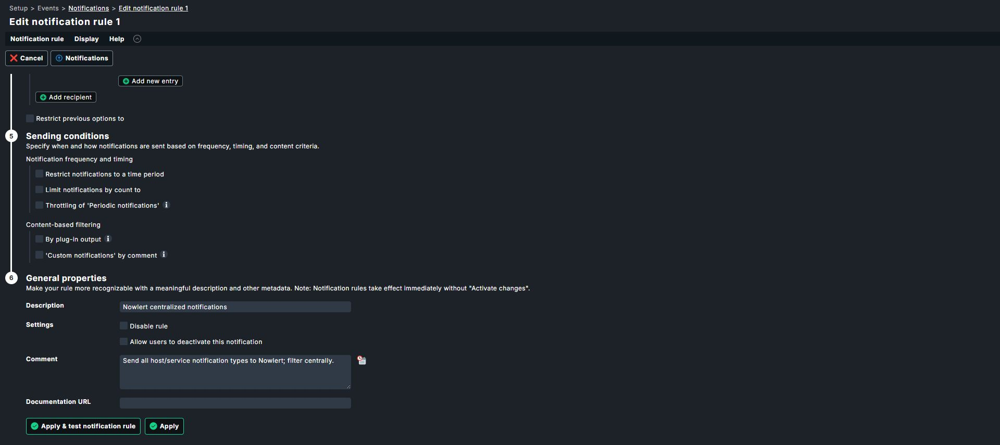

# Checkmk host and service notifications to Nowlert

Tested with Checkmk **2.5.0p14 Community**, site `example`. Real native host/service
notifications were delivered to the Criticals destination. This uses Checkmk's
notification script interface; it does not poll hosts or install another agent.

First complete [Nowlert route and token setup](application-notification-setup.md)
for **Checkmk HTTP**, scope `checkmk`.

## Install the notification method

Run as your **Checkmk site user** (inside the site container if applicable).
Copy [the supplied script](../../tools/checkmk_notification.py) to
`~/local/share/check_mk/notifications/nowlert`. The local example's absolute
path is `/omd/sites/example/local/share/check_mk/notifications/nowlert`.

```sh
chmod 0755 ~/local/share/check_mk/notifications/nowlert
mkdir -p ~/.config/nowlert
chmod 0700 ~/.config/nowlert
touch ~/.config/nowlert/checkmk.json
chmod 0600 ~/.config/nowlert/checkmk.json
```

Privately edit `~/.config/nowlert/checkmk.json`:

```json
{"url":"https://YOUR_NOWLERT/checkmk/events","token":"YOUR_CHECKMK_TOKEN"}
```

Keep both files in persistent site storage, owned by the site user. Use HTTPS,
the exact `/checkmk/events` path, and no query string. The script supplies
`X-Nowlert-Token` and validates TLS certificates. Do not put the token in rule
parameters.

## Create the native notification rule

Open **Setup → Events → Notifications** and add a rule:

| Setting | Configured value |
|---|---|
| Description | Nowlert centralized notifications |
| Method | Nowlert |
| Method parameters | None |
| Recipient | One explicit contact (`itadmin` in the local setup) |
| Notification bulking | Disabled |
| Asynchronous spooling | Enabled |
| Host/service, state and type restrictions | No restrictions for broad native coverage |

The saved rule selects **All events** and the native Nowlert method:



It sends once to the explicit recipient:



Save. Activate changes **only if Checkmk shows pending changes**. On the tested
2.5 site, notification-rule saves were immediate and activation correctly
reported no changes. Existing email rules can remain enabled.

Use one contact rather than all contacts to avoid a copy of the same notification
for each recipient. Checkmk still applies its notification periods,
acknowledgements, downtime and contact logic. Nowlert cannot receive an event
Checkmk suppresses.

## Test and inspect

Use a native Checkmk test/custom notification for a known monitored object;
avoid intentionally breaking a production service. Check `~/var/log/notify.log`
and `~/var/log/mknotifyd.log`, then match the event in Nowlert Delivery history
and confirm it arrived at the destination.

The script returns 0 for receiver acceptance, 1 for retryable transport/429/5xx
errors, and 2 for final configuration/authentication/payload errors. Receiver
acceptance is separate from destination delivery.

Filter centrally by host, service, check state or notification type. Problem,
recovery, acknowledgement, downtime, flapping and custom notification contexts
remain distinguishable.

## Saved rule and verification status

The sending-condition screenshot shows no upstream rate/time/output restriction,
the enabled rule, and Checkmk's immediate-save behavior:



These are captures of the actual saved rule. Native host/service delivery was
verified separately on the local installation; an edit-form capture alone does
not prove callback delivery.

Reference: [Checkmk notification scripts](https://docs.checkmk.com/latest/en/notifications.html#scripts).

[All infrastructure tutorials](infrastructure-tutorials.md)
