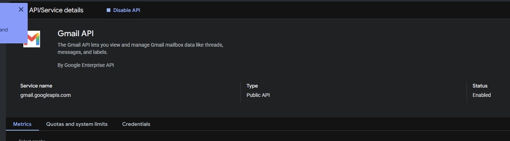

# Gmail email alerts in Nowlert CE

Connect a Gmail mailbox, classify No-IP hostname notices, and send matching
messages through Nowlert's Email Alerts route. Google OAuth is configured once
by the installation administrator; mailbox owners sign in with Google rather
than entering their Google password or application secret into Nowlert.

## Before you start

- Use a Nowlert build containing Email Alerts and deployment-owned OAuth support.
- Have access to a Google Cloud project and the Gmail mailbox you will monitor.
- Make the Nowlert HTTPS URL reachable from the browser completing consent.
- Allow the container outbound HTTPS access to Google's authorization and Gmail APIs.
- Keep the existing persistent state and secrets mounts when updating the stack.

Examples use `https://nowlert.example.com`. Substitute your own hostname in every
step. The callback is **`https://nowlert.example.com/ui/`**, including the trailing
slash. It is an OAuth callback, not an integration webhook or ingestion token.

## 1. Enable Gmail and register the Google application

1. In Google Cloud, select the project that will own the integration.
2. Find **Gmail API** in the API Library and click **Enable**. Its service-details
   page must show **Status: Enabled**.

   

3. Open **Google Auth Platform → Branding**. Complete the application's name,
   support contact and developer contact using your own details.
4. Under **Audience**, choose the audience appropriate to your account. A personal
   Gmail account uses **External**. In **Testing**, add the intended mailbox under
   **Test users**; an account not listed there cannot authorize the app.
5. Under **Data access → Add or remove scopes**, add only:

   ```text
   https://www.googleapis.com/auth/gmail.readonly
   ```

   Save the scope declaration. Google labels this a restricted scope, allowing
   the application to read email messages and settings. It does not allow sending
   mail, deleting messages or editing the mailbox. See [Google's scope reference](https://developers.google.com/workspace/gmail/api/auth/scopes).

6. Under **Clients → Create client**, select **Web application**. Name it for this
   installation and add `https://nowlert.example.com/ui/` as an **Authorized
   redirect URI**. The callback belongs in redirect URIs, not JavaScript origins.
7. Create the client and store its client ID and secret privately. Do not put
   the downloaded credential JSON or secret in Git, chat, screenshots or logs.

**Testing is temporary:** Google expires authorization refresh tokens after
seven days for an external Testing app using Gmail scopes. For unattended
monitoring, complete Google's applicable production/publishing requirements and
reauthorize after leaving Testing. Publishing and Google verification are
separate processes; do not promise an indefinitely valid connection simply
because the first consent succeeded. See [Google's token-expiry guidance](https://developers.google.com/identity/protocols/oauth2#expiration).

## 2. Configure the existing Nowlert service

Place only the Google client-secret value in a protected file under the host's
existing secrets directory. Mount that directory read-only at `/run/secrets`.
The file must be readable by the container's service UID/GID; use restrictive
permissions, not a world-readable file.

Add these entries to the existing service's environment:

```yaml
environment:
  NOWLERT_EMAIL_GMAIL_CLIENT_ID: YOUR_GOOGLE_CLIENT_ID
  NOWLERT_EMAIL_GMAIL_CLIENT_SECRET_FILE: /run/secrets/nowlert_email_gmail_client_secret
  NOWLERT_EMAIL_GMAIL_REDIRECT_URI: https://nowlert.example.com/ui/
```

Recreate the Nowlert service to load the environment changes, preserving its
image, volumes, ports and networks. In Portainer, update the existing stack;
do not replace its persistent database. See [deployment configuration](../deployment.md#email-alerts-oauth-applications).

## 3. Connect the mailbox

1. Open **Email Alerts → Mailboxes → + Connect mailbox**.
2. Choose **Gmail**, enter a descriptive mailbox name and the intended email
   address, and choose **Private** or **Shared** deliberately.
3. Click **Continue to Google**. If it is disabled with “Gmail connections are
   not configured,” correct the deployment configuration first.
4. Sign in to the intended Google account. Review the app and its requested
   read-only access before completing consent. A Testing app may display an
   unverified-app notice; only proceed for an application you own and recognize.
5. Return to Nowlert. Confirm **Credentials configured**, **Healthy**, and a
   recent **Last sync**. Use **Sync now** to request another synchronization.
6. Use the mailbox's **Edit** control to select the labels/folders to monitor.
   Choose a scope that includes the real No-IP notices.


## 4. Create rules and assign a destination

Follow the [shared No-IP and OpenAI rule walkthrough](gmail-microsoft-email-alerts.md#no-ip-and-openai-status-rules).
The same rule can cover both providers when they belong to the same Nowlert
owner. Do not create a duplicate rule for Gmail unless its conditions differ.

In **Destinations**, edit the target destination, open **Manage routes**, select
**Email Alerts**, click **Done**, and save the destination. Centralized filters
still apply. A connected mailbox alone does not configure destination delivery.

## 5. Verify with a real email

Open **Email Alerts → Activity** and search for a relevant hostname notice.
Confirm the mailbox, sender domain, matched rule and resulting classification.
Then check **Delivery history** for the same event and a successful destination
response. A rule preview validates matching, not end-to-end delivery.


The local validation on **4 October 2026** confirmed Gmail consent,
synchronization and a real No-IP expiry-reminder match. The captured message is
historical; it does not establish the hostname's current expiry or renewal state.
Destination delivery is a separate acceptance check. The Google application was
still in Testing at validation, so production authorization remains outstanding.

## Troubleshooting

| Symptom | Check |
|---|---|
| Connection button disabled | Client ID, readable secret file and redirect configuration; recreate the service after changing environment. |
| `redirect_uri_mismatch` | Exact callback scheme, hostname, `/ui/` path and trailing slash in Google and Nowlert. |
| User blocked by Testing app | Correct project/client and account listed under Test users. |
| Gmail API request rejected | Gmail API enabled in the same project as the OAuth client; correct read-only scope granted. |
| Mailbox needs reconnect after a week | External Testing authorization expiry; complete production setup and reconnect. |
| No matching No-IP events | Monitored labels/folders, actual sender domain and subject, rule owner and enabled state. |
| Match visible but no destination notification | Email Alerts route assignment, group delivery settings, centralized filtering and Delivery history. |
