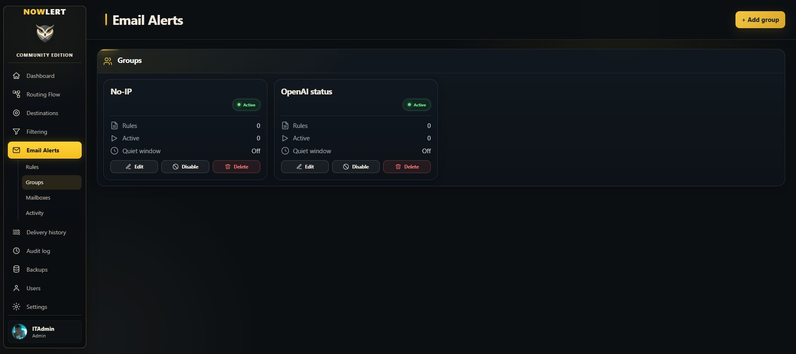

# Connect Gmail and Microsoft mailboxes to Nowlert

Email Alerts reads mailbox metadata, classifies matching messages, and forwards
them through Nowlert's existing routing and destination filters. The installation
administrator configures a provider application once; each mailbox owner then
signs in to the provider and authorizes their mailbox.

## Current local setup status

The local installation has the **No-IP** and **OpenAI status** groups saved,
with quiet windows disabled. The Microsoft application is registered in the
intended tenant and its public certificate is uploaded. Gmail application setup,
Microsoft delegated `Mail.Read` is configured. Deployment and mailbox consent
are still pending.
There are no connected mailboxes or enabled rules
for these sources yet. This page describes the configuration procedure; it is
not a claim of verified native mailbox delivery.



## Register the provider applications

Use the exact callback URL derived from the installation's canonical WebUI URL:

```text
https://nowlert-ce.local.fortpt.com/ui/
```

The browser completing authorization must be able to reach this local hostname.
Register the identical URL, including the trailing slash. Do not expose Nowlert
publicly just to configure a browser redirect. A provider may impose additional
domain and tenant policies that must be satisfied by the app registration.

### Google

1. Open Google Cloud and select the intended project. Enable the Gmail API.
2. Configure Google Auth Platform branding and audience for the mailbox users.
3. Create an OAuth client of type **Web application**. Register the callback URL
   above as an authorized redirect URI.
4. Configure the requested read-only scope:
   `https://www.googleapis.com/auth/gmail.readonly`.
5. Keep the application client secret private. An external application left in
   Testing can require periodic reauthorization; review Google's token-expiry
   and consent policies before using it for unattended monitoring.

See Google's [web-server OAuth setup](https://developers.google.com/identity/protocols/oauth2/web-server)
and [token expiration guidance](https://developers.google.com/identity/protocols/oauth2#expiration).

### Microsoft

1. Open Microsoft Entra **App registrations** and create or reuse the intended
   Nowlert application.
2. Select the supported account audience appropriate for the mailbox. Personal
   Outlook accounts require an audience that includes personal Microsoft accounts.
3. Add a **Web** platform with the exact callback URL above.
4. Configure Microsoft Graph **delegated** `Mail.Read` permission. Nowlert requests
   `openid profile email offline_access` and `https://graph.microsoft.com/Mail.Read`.
   It does not need application-wide mailbox permissions or `Mail.Send`.
5. Use a certificate credential if your tenant prohibits client secrets (see
   below), or create an application client secret and store its value privately. Use the
   appropriate directory tenant ID, or a supported common/consumer authority
   matching the registered account audience.

See Microsoft's [redirect URI setup](https://learn.microsoft.com/en-us/entra/identity-platform/how-to-add-redirect-uri)
and [application audience configuration](https://learn.microsoft.com/en-us/entra/identity-platform/msal-client-application-configuration).

### Microsoft certificate authentication

Nowlert supports a deployment-owned PEM X.509 certificate and matching RSA
private key for the same delegated mailbox sign-in flow. This does not grant
access to all tenant mailboxes. Each mailbox still requires its owner's consent.

1. Generate an RSA key of at least 2048 bits and a matching certificate. Keep
   the unencrypted private key in the host's restricted secrets directory,
   readable only by the Nowlert service. Never upload or commit the private key.

   For a new installation, run this in its existing secrets directory. These
   filenames must not already exist; retain any existing credentials during
   rotation.

   ```sh
   umask 077
   test ! -e nowlert_email_microsoft_private_key &&
   test ! -e nowlert_email_microsoft_certificate &&
   openssl req -x509 -newkey rsa:3072 -sha256 -days 365 -nodes \
     -subj '/CN=Nowlert CE Email Alerts' \
     -keyout nowlert_email_microsoft_private_key \
     -out nowlert_email_microsoft_certificate
   ```
2. In the intended tenant's application, open **Certificates & secrets →
   Certificates → Upload certificate** and upload only the public certificate.
3. Mount both files read-only and configure:

   ```yaml
   environment:
     NOWLERT_EMAIL_MICROSOFT_CLIENT_ID: YOUR_APPLICATION_ID
     NOWLERT_EMAIL_MICROSOFT_TENANT_ID: YOUR_DIRECTORY_ID
     NOWLERT_EMAIL_MICROSOFT_CERTIFICATE_FILE: /run/secrets/nowlert_email_microsoft_certificate
     NOWLERT_EMAIL_MICROSOFT_PRIVATE_KEY_FILE: /run/secrets/nowlert_email_microsoft_private_key
     NOWLERT_EMAIL_MICROSOFT_REDIRECT_URI: https://nowlert-ce.local.fortpt.com/ui/
   ```

4. Restart the service with the updated configuration, then connect the mailbox
   through Email Alerts. Retain the delegated `Mail.Read` permission.
5. Rotate the certificate before expiry: upload the replacement public
   certificate, replace the mounted pair, and restart Nowlert. Verify mailbox
   synchronization before removing the old certificate from Entra.

Certificate configuration takes precedence over a client secret. Missing,
expired, malformed, weak or mismatched certificate credentials fail closed;
Nowlert does not fall back to a secret. A fresh five-minute PS256 assertion is
used for both authorization-code exchange and refresh. Private keys are not
stored in mailbox records, returned in provider status, or included in tutorials.

See Microsoft's [certificate assertion specification](https://learn.microsoft.com/en-us/entra/identity-platform/certificate-credentials).

## Configure the Nowlert container

Add the public application identifiers and secret-file paths to the existing
Nowlert service's environment. Preserve its image, volumes, ports and networks:

```yaml
environment:
  NOWLERT_EMAIL_GMAIL_CLIENT_ID: YOUR_GOOGLE_CLIENT_ID
  NOWLERT_EMAIL_GMAIL_CLIENT_SECRET_FILE: /run/secrets/nowlert_email_gmail_client_secret
  NOWLERT_EMAIL_MICROSOFT_CLIENT_ID: YOUR_MICROSOFT_CLIENT_ID
  NOWLERT_EMAIL_MICROSOFT_TENANT_ID: YOUR_TENANT_ID
  NOWLERT_EMAIL_MICROSOFT_CLIENT_SECRET_FILE: /run/secrets/nowlert_email_microsoft_client_secret
  NOWLERT_EMAIL_OAUTH_REDIRECT_URI: https://nowlert-ce.local.fortpt.com/ui/
```

Store only each secret value in the corresponding file under the existing
read-only `/run/secrets` mount. Do not paste secrets into documentation, screenshots,
mailbox settings or Git. Recreate the Nowlert service to load changed environment
variables. Confirm both OAuth connection buttons become available.

## Connect each mailbox

Open **Email Alerts → Mailboxes → Connect mailbox**. Select Gmail or Microsoft
365, identify the intended mailbox and complete provider sign-in and consent.
The provider password stays with Google or Microsoft. Confirm the mailbox becomes
healthy and that synchronization succeeds before configuring delivery rules.

## Add No-IP and OpenAI status rules

1. Inspect the actual sender address/domain and subject from a representative
   message in the connected mailbox. Do not match display names alone.
2. In **Email Alerts → Rules**, create a rule in **No-IP** for actionable hostname
   confirmation, renewal or expiry messages. Match the verified sender plus the
   actual subject patterns. Classify reminders as Warning; use a separate
   higher-priority rule for urgent expiry notices if needed.
3. Create an **OpenAI status** rule matching the verified status-email sender and
   subject identifying OpenAI. Include incident updates and resolutions; do not
   silently discard resolution messages. Email classifications are Urgent,
   Warning, Information or Ignore, rather than a provider-independent incident
   lifecycle inference.
4. Use the rule preview against representative messages and a negative control
   from an unrelated sender. Keep mailbox and sender conditions specific.
5. Assign the built-in Email Alerts route to the desired destination, save the
   destination, and confirm centralized filtering permits the intended classes.

Keep quiet windows off initially. Tune repeats only after observing actual
message patterns, so meaningful incident updates are not suppressed.

## Verify delivery

Check **Email Alerts → Activity** for synchronization, matched rule, classification
and dispatch. Confirm the same message in **Delivery history**, including the
destination's successful response. Reprocessing the same provider message should
not produce duplicate deliveries. A rule preview or synthetic message test does
not establish provider OAuth, background synchronization or native email delivery.

See [deployment OAuth configuration](../deployment.md#email-alerts-oauth-applications)
for the per-installation credential model and redirect overrides.
