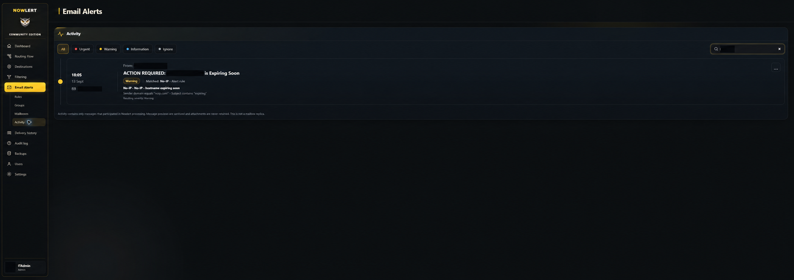
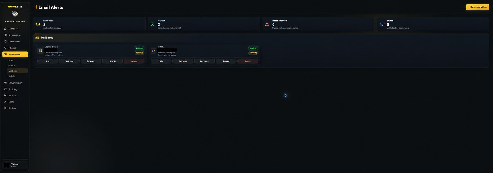

# Gmail and Microsoft Email Alerts: rules and delivery

Use Nowlert Email Alerts to connect a mailbox, classify matching messages and
forward actionable notices through existing routes and destinations. Each
installation has its own provider application credentials; each mailbox owner
consents to read-only access. Credentials are not bundled in the Nowlert image.

## Choose a provider walkthrough

- [Gmail: Google project, OAuth, mailbox connection and verification](gmail-email-alerts.md)
- [Microsoft 365 / Outlook: Entra, certificate or secret, connection and verification](microsoft-email-alerts.md)

The examples use `https://nowlert.example.com/ui/`. Replace the hostname with the
canonical HTTPS URL of your installation and register the exact callback,
including the trailing slash. The browser must reach that URL; the container
must reach the provider APIs. The Google callback and Microsoft Web callback are
OAuth redirects, not SMTP listeners or Nowlert integration webhooks.

## No-IP and OpenAI status rules

These rules are shared by the same owner's Gmail and Microsoft mailboxes. Add a
mailbox condition if a rule should apply to just one connection. Avoid duplicate
provider-specific copies of an otherwise identical rule.

1. Connect the mailbox and verify **Healthy** and a recent **Last sync**.
2. Inspect an actual message under **Email Alerts → Activity**. Verify its sender
   domain and subject before choosing conditions; display names alone are not
   reliable matching criteria.
3. Under **Email Alerts → Groups**, create **No-IP** and **OpenAI status**, or reuse
   the existing groups. Review their delivery settings and leave quiet windows
   off while validating the first events.
4. Under **Email Alerts → Rules**, add the following rules with **Enabled** status
   and **All conditions (AND)**. Lower priority numbers are evaluated first.

| Group | Rule | Classification | Priority | Conditions |
|---|---|---|---|---|
| No-IP | No-IP - hostname expired | Urgent | 10 | Sender domain equals `noip.com`; Subject contains `expired` |
| No-IP | No-IP - hostname expiring soon | Warning | 20 | Sender domain equals `noip.com`; Subject contains `expiring` |
| OpenAI status | OpenAI status - incident resolved | Information | 10 | Sender domain equals `statuspage.io`; Subject contains `OpenAI`; Body contains `This incident has been resolved` |
| OpenAI status | OpenAI status - incident updates | Warning | 30 | Sender domain equals `statuspage.io`; Subject contains `OpenAI` |

The No-IP pattern was verified against a real message from each connected
mailbox. The OpenAI patterns were checked with representative samples; a native
OpenAI incident/resolution pair has not yet been captured. Verify your real
status subscription's sender and resolution wording before treating those
patterns as proven for your mailbox. These are email classifications, not an
inferred incident lifecycle. A resolution is Information in this setup.

The sender-domain condition distinguishes OpenAI incident subscriptions from
OpenAI newsletters. The subject condition also prevents another vendor's
Statuspage messages matching merely because they use `statuspage.io`. Body
conditions retrieve message content only when an enabled rule requires it;
attachments are not used for matching.

5. Save each rule and preview representative messages. Check a No-IP reminder,
   an expiry notice, an incident update and its resolution, plus unrelated
   marketing and another vendor's status email as negative controls.
6. In **Destinations**, edit the target, open **Manage routes**, select **Email
   Alerts**, click **Done**, and **Save changes**. Review destination filters so
   the desired classifications are permitted.

## Verify the complete path

A connection and a rule preview are only part of the acceptance check:

1. Receive a new relevant email in a selected folder/label.
2. Confirm mailbox synchronization remains healthy.
3. In **Activity**, verify the actual message, matched group/rule and severity.
4. In **Delivery history**, find the corresponding event and successful response
   for the intended destination. Inspect filtered outcomes if dispatch is absent.
5. Synchronize again and check that the same provider message has not produced
   duplicate deliveries. Do not replay historical messages just to create proof.

An expiry reminder does not confirm a hostname's current expiry or renew it.
Check the No-IP account separately if you need to confirm or renew the hostname.

## Validation and screenshot notes

On **4 October 2026**, the local deployment had both Gmail and Microsoft mailboxes
connected and healthy, with successful background synchronization. Microsoft
used a deployment-owned certificate. Real stored No-IP notices matched the
warning rule. Four enabled No-IP/OpenAI rules were saved.

The Gmail application remained in **Testing**, so its authorization is temporary:
Google expires Gmail-scope refresh tokens from external Testing apps after seven
days. Production publishing requirements and reauthorization remain outstanding.
See [Google's token-expiry documentation](https://developers.google.com/identity/protocols/oauth2#expiration).

This evidence confirms provider connection, synchronization and No-IP matching.
Native OpenAI incident/resolution emails and email-to-destination delivery proof
remain separate acceptance items. Do not advertise them as verified from these
screenshots. The local certificate-support build is a development candidate;
verify the feature in your chosen release image before deploying.

Screenshots are privacy-edited illustrations of the configured pages. Account
labels, email addresses and the example hostname are concealed. Google's API
capture is cropped to omit the signed-in account header. No application secret,
mailbox authorization token or private key is included. The written validation
status comes from the actual application state and rule checks, rather than
from edited image pixels alone.

For environment variables and secret mounts, see
[deployment OAuth configuration](../deployment.md#email-alerts-oauth-applications).
