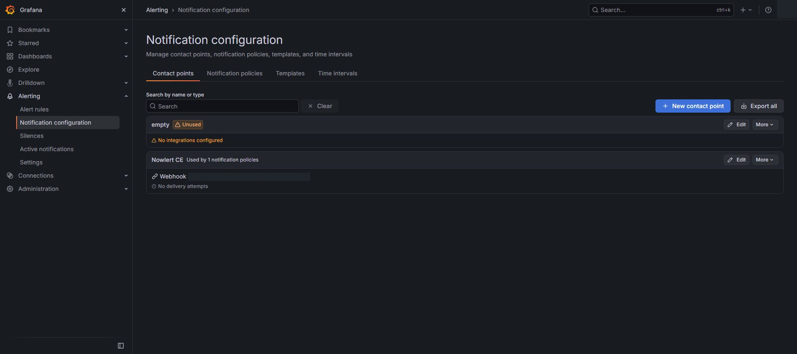
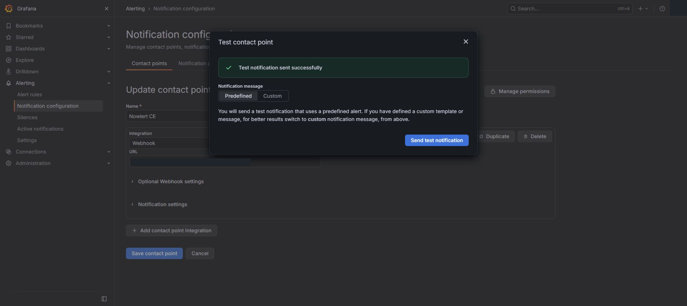

# Grafana Alerting to Nowlert CE

Grafana sends its native webhook notifications to Nowlert. Nowlert applies the
assigned route and centralized filters before delivering to your destination.
This walkthrough was validated on 3 October 2026 with Grafana 13.2.3 and Nowlert
development image `sha-abdc92887fc508bf1f105697eb48772acda78b08`.

## Prepare Nowlert

1. Follow [shared application setup](application-notification-setup.md).
2. Issue an application token scoped only to **Grafana**. The local example uses
   300 requests per minute and grants no administrator access.
3. Assign the existing **Grafana HTTP** route to your destination. Do not create
   another route for the same integration. Our example uses **Operational**.

## Configure one native contact point

In Grafana, open **Alerting → Notification configuration → Contact points**.
Create or update one contact point named `Nowlert CE`:

| Setting | Value |
|---|---|
| Integration | Webhook |
| URL | `https://nowlert.example.com/grafana/alerts` |
| HTTP method | POST |
| Authorization scheme | Bearer |
| Authorization credentials | Your Grafana-scoped Nowlert token |
| Disable resolved message | Off |

Save the contact point, then select it in the notification policy that covers
your desired rules. The local installation initially had no alert rules or
notification integrations; its default policy now uses this contact point.
Existing policies must be reviewed before changing their receiver.

## Verify the contact and alert lifecycle

Use **Test → Send test notification** on the contact point. Check the result in
Grafana and the corresponding delivery in Nowlert. A successful contact test
alone does not establish that a real rule or recovery notification works.

For the full lifecycle, create a clearly named disposable Grafana-managed rule
with a math expression `1 > 0`, using a dedicated test notification policy.
After its firing notification arrives, change the expression to `0 > 0` and
verify its resolved notification. Remove the disposable rule and test policy
afterward. This tests Grafana's evaluator and sender without introducing a
physical infrastructure fault.

Our controlled native rule delivered both **Firing** and **Resolved** to
Operational with HTTP 200. The temporary rule and policy were removed.
The [token-free delivery readback](../images/monitoring-setup/records/grafana-native-validation.json)
records these two attempts. These are native rule tests, not laptop-generated
callbacks and not evidence of a physical device fault.

## Avoid duplicate monitoring

Choose an owner for each condition. In this installation, Checkmk retains the
host and device checks. Grafana's sole permanent rule is **Grafana telemetry
query unavailable or stale**:

- Query: `time() - timestamp(up{job="prometheus"})`.
- Condition: result greater than 120 seconds for two minutes.
- No Data and evaluation errors: Alerting.
- Scope: Grafana's telemetry query path, not a device outage.

Do not create the same condition in both Grafana and Prometheus. Let Nowlert
filter source notifications centrally rather than duplicating destination
webhooks inside every application.

## Troubleshooting

- No delivery: check the notification policy, route assignment, scoped token,
  receiver reachability, and Grafana's notification log.
- Firing arrives but recovery does not: keep **Disable resolved message** off
  and review Nowlert filters for resolved events.
- Multiple deliveries: look for duplicate policies, contact integrations,
  routes, or rules monitoring the same condition.

See [Grafana's contact-point documentation](https://grafana.com/docs/grafana/latest/alerting/configure-notifications/manage-contact-points/).

