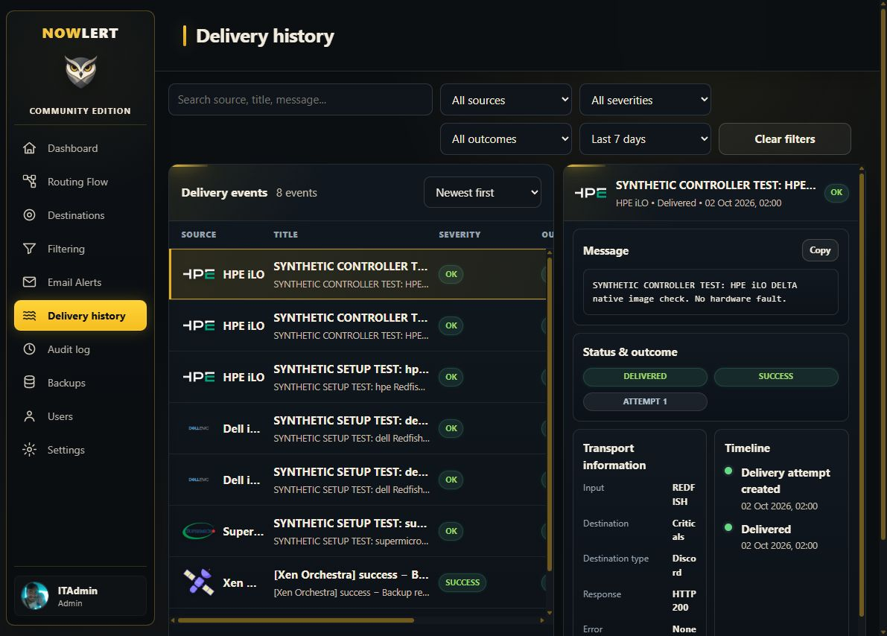
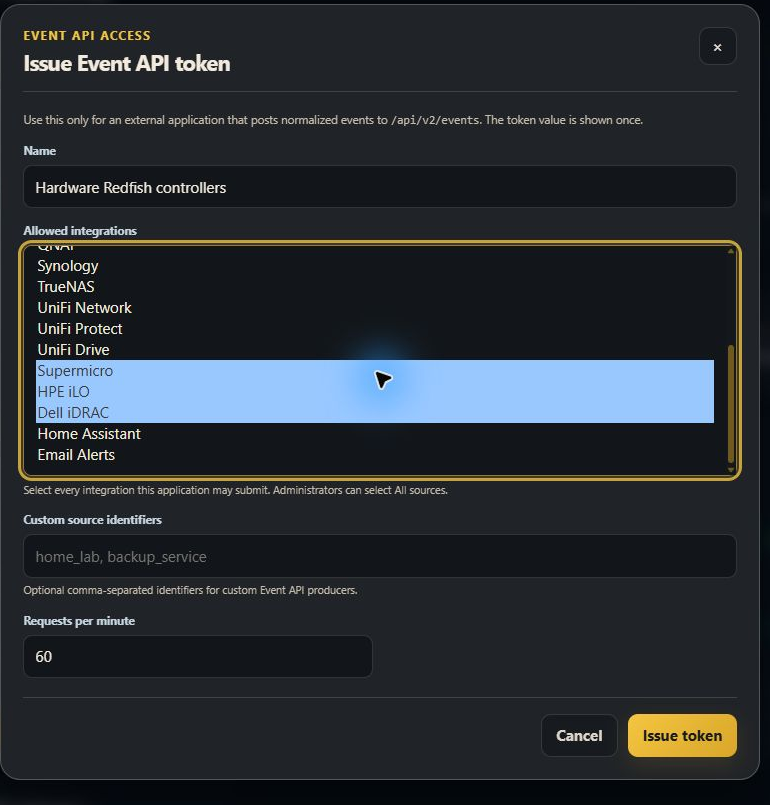
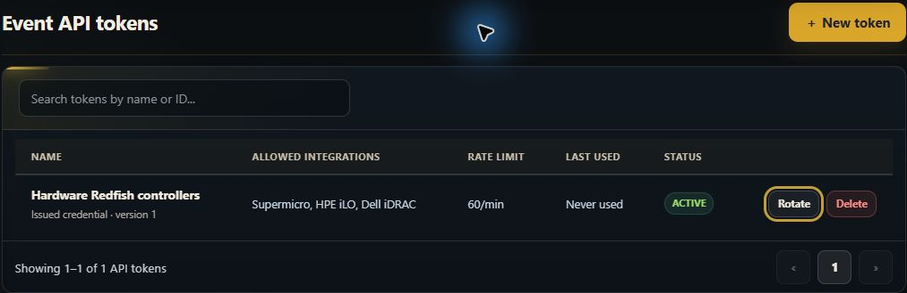
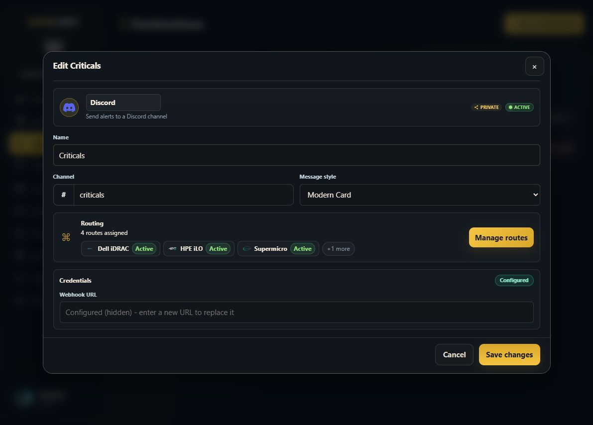
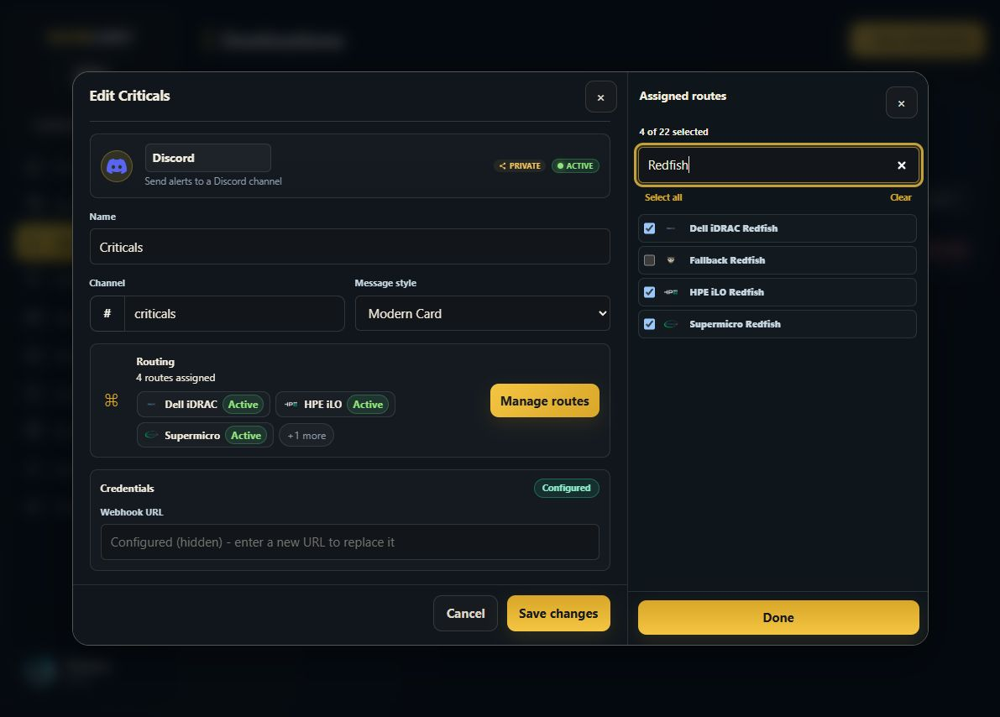
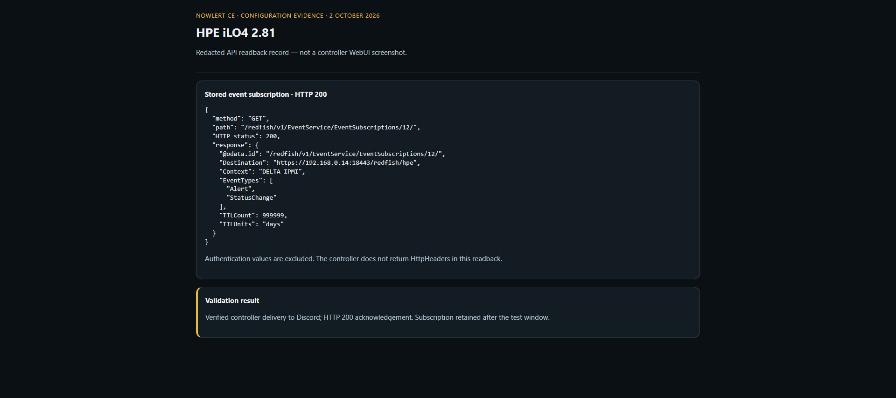
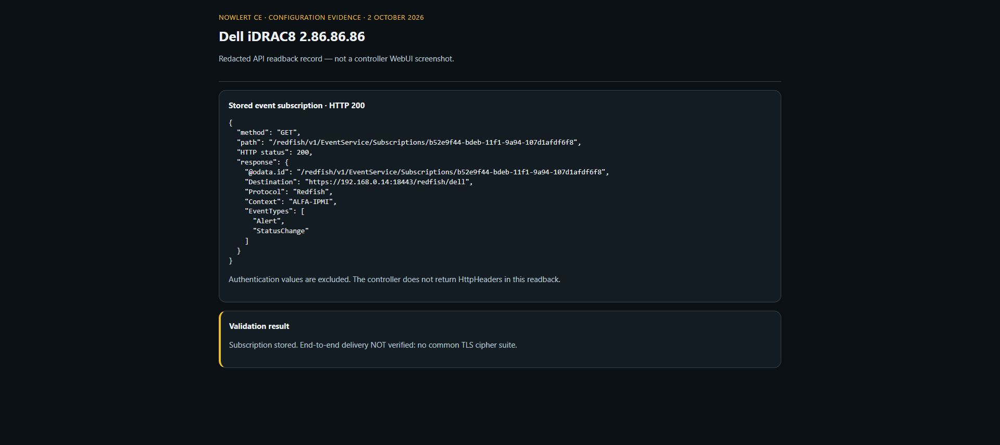
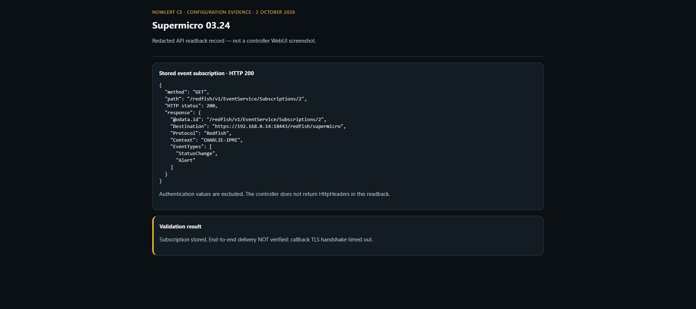

# Connect Supermicro, Dell iDRAC, and HPE iLO to Nowlert CE

This walkthrough covers token creation, controller subscriptions, and delivery
verification, including destination setup and built-in route assignments.
Nowlert receives pushed events; it does not need the controller password for
normal operation.

```text
Controller Event Service → authenticated HTTPS POST → Nowlert Redfish route → Discord
```

## Before you begin

- Run an image that includes native chunked-body support and the iLO HTTP 200
  acknowledgement. The tested development commit is
  `d1daf765b4c98a40f884610d75c97b1f4dfb7b51`; it was not yet promoted to stage/stable
  when these screenshots were taken.
- Have a Discord webhook and a Nowlert account allowed to edit its destination.
- Use a Redfish API client with a controller account permitted to create event
  subscriptions. These credentials authenticate setup calls to the controller;
  the Nowlert token authenticates callbacks in the opposite direction.
- Make the HTTPS callback reachable from the controllers' management network.
  Verify certificate and TLS compatibility on the actual firmware.

Screenshots show the local example deployment. Substitute your own addresses,
channel names, and controller contexts.

## Validation status

The token and receiver steps below were exercised on a local instance. Earlier synthetic
events sent to all three vendor endpoints returned HTTP 204 and appeared as
DELIVERED in Nowlert. These checks validate receiver authentication and routing;
they do **not** prove that a controller can reach the receiver.

All three controllers accepted subscription creation with HTTP 201. The current
controller-originated validation results are:

| Controller | Result |
|---|---|
| HPE iLO4 2.81 | Verified: controller test reached Nowlert through the dedicated local callback and was delivered to the Criticals Discord destination, HTTP 200, attempt 1. |
| Dell iDRAC8 2.86.86.86 | Not verified: callback TLS negotiation failed because the controller and receiver offered no common cipher suite. |
| Supermicro 03.24 | Not verified: callback TLS handshake timed out; the cause remains unresolved. |

The native-image HPE test was recorded on 2 October 2026 at 02:00 in Nowlert's delivery
history. Earlier failed HPE subscriptions exhausted their delivery retries and
were removed by the controller. Subscription creation and acceptance of a test
action alone are not delivery proof.

With the native image, the receiver acknowledged the controller's chunked request
with HTTP 200. The subscription still existed more than three minutes later,
and the callback logs showed one request rather than repeated delivery retries.
This observation validates the test window, not indefinite subscription health.



For this older iLO, the working callback was a dedicated, controller-restricted
HTTPS listener on the local Docker host, port 18443. It accepts TLS connections
without SNI. The development image at commit `d1daf765b4c98a40f884610d75c97b1f4dfb7b51`
accepts chunked HTTP bodies natively and acknowledges `/redfish/hpe` with HTTP 200.
The test used the TLS listener forwarding directly to Nowlert; no buffering
adapter was involved. TLS certificates and the no-SNI listener are still an
instance-specific configuration. The main
website listener remains separate. Do not assume this configuration also works
for the two unverified controllers.

## 1. Issue a hardware token

1. Open your profile menu, then **Security**.
2. Under **Event API tokens**, choose **New token**.
3. Name it `Hardware Redfish controllers`.
4. Select **Supermicro**, **HPE iLO**, and **Dell iDRAC**. A separate token per
   controller is also possible and allows independent rotation.
5. Set an appropriate request limit; the example uses 60 requests per minute.
6. Choose **Issue token** and save the one-time value privately.



Although the dialog describes the normalized Event API, these source-scoped
tokens also authenticate the corresponding vendor Redfish receivers.



## 2. Configure the destination and assign built-in routes

1. Open **Destinations**, then **New destination** and choose **Discord**.
2. Enter a name, channel label, and Discord webhook URL. Keep the destination active.
3. Open **Manage routes**. Select **HPE iLO Redfish**, **Dell iDRAC Redfish**, and
   **Supermicro Redfish** for a shared hardware channel, or assign each route to
   its own destination. Search `Redfish` to find them.
4. Choose **Done**, then **Add destination** or **Save changes**.

The image supplies these routes on a fresh instance. Assign them rather than
creating duplicate routes. Start with broad filters for the first test.





## 3. Choose the callback endpoint

Replace `nowlert.example.com` with the HTTPS address reachable from the
controller's management network.

| Controller | Callback | Required token scope |
|---|---|---|
| Supermicro | `https://nowlert.example.com/redfish/supermicro` | `supermicro` |
| Dell iDRAC | `https://nowlert.example.com/redfish/dell` | `dell_idrac` |
| HPE iLO | `https://nowlert.example.com/redfish/hpe` | `hpe_ilo` |

Events use POST and `Content-Type: application/json`. Send the credential in
`X-Nowlert-Token`, or `Authorization: Bearer <token>`. Do not put it into a URL,
public screenshot, or committed JSON file.

Check DNS, routing, firewall access, and receiver certificate trust from the
controller network. A successful request from an operator's laptop alone does
not check that path.

## 4. Discover the controller's Event Service

Using a Redfish API client authenticated to the controller, read
`GET /redfish/v1/EventService`. Follow the subscription collection link returned
by that resource. Firmware generations differ; an SMTP settings screen configures
email delivery and is not a Redfish subscription editor.

The controllers inspected for this walkthrough were Supermicro firmware 03.24,
iDRAC8 firmware 2.86.86.86, and iLO4 firmware 2.81. Their authenticated capabilities
must be checked before treating the examples below as a supported configuration.

### HPE iLO4

HPE documents event subscriptions starting with iLO4 2.30, using the collection
`/redfish/v1/EventService/EventSubscriptions/`. Its documented `HttpHeaders`
format is an object. A payload for initial validation is:

```json
{
  "Destination": "https://nowlert.example.com/redfish/hpe",
  "EventTypes": ["Alert", "StatusChange"],
  "HttpHeaders": {"X-Nowlert-Token": "<private-token>"},
  "Context": "Nowlert HPE hardware alerts",
  "TTLCount": 999999,
  "TTLUnits": "days"
}
```

HPE reserves TTLCount `999999` for a perpetual subscription; verify the returned
value after creation. With a finite TTL, renew before expiry. HTTP 201
means the subscription was created, not that delivery was tested. See
[HPE's iLO4 subscription documentation](https://github.com/HewlettPackard/ilo-rest-api-docs/blob/master/source/includes/_ilo4_subscribing.md)
and [iLO4 Event Service TTL reference](https://hewlettpackard.github.io/ilo-rest-api-docs/ilo4/#ttlcountdefault).

Submit this JSON as a POST to the subscription collection using your controller
credentials. Keep `Content-Type: application/json`. Save the resource URL returned
in `Location`, then GET that resource to verify the stored destination and TTL.



This is a rendered record of the actual API readback, not an iLO WebUI page.
The subscription was created through Redfish, not through iLO's SMTP settings.

### Dell iDRAC8 and Supermicro

The usual collection is `/redfish/v1/EventService/Subscriptions`, but follow
the link on the device rather than assuming it exists. Verify supported
event types, authentication-header support, privileges, and licensing on the
installed firmware. Do not copy an iDRAC9 telemetry payload into iDRAC8.

If the controller cannot send the authentication header, use a restricted
header-injecting relay. Keep the Nowlert receiver authenticated. The relay must
accept only the intended controller traffic and must keep its token private.

See [Dell's iDRAC8 Event Service reference](https://www.dell.com/support/manuals/en-in/poweredge-r730/idrac8_redfishapiguide_2.70.70.70/eventservice?guid=guid-8491e00c-bd99-4cbd-ad54-8506993ef5a9&lang=en-us)
and [Supermicro's Event Service reference](https://www.supermicro.com/en/support/manuals/product/software/redfish-user-guide-4-0/Content/general-content/event-service.htm).
The latter describes newer firmware and does not establish compatibility with
the older 03.24 controller.

On the inspected iDRAC8 and Supermicro firmware, the accepted subscription payload
uses an **array** for `HttpHeaders`, unlike iLO4's object:

```json
{
  "Destination": "https://nowlert.example.com/redfish/dell",
  "Protocol": "Redfish",
  "EventTypes": ["Alert", "StatusChange"],
  "HttpHeaders": [{"X-Nowlert-Token": "<private-token>"}],
  "Context": "Nowlert Dell hardware alerts"
}
```

For Supermicro, change the destination to `/redfish/supermicro` and choose a
matching context. POST to the collection returned by that controller's Event
Service and GET the new resource returned in `Location`. Preserve the path's
trailing slash when required by the device; do not forward credentials across
an unexpected redirect.





These two images are also rendered, token-free API readback records. The firmware
omitted `HttpHeaders` from its GET response; the omission alone does not prove
the token was absent from the submitted configuration.

## 5. Test the full controller path

1. Read back the new subscription and check its destination and enabled status.
   Redact authentication headers before capturing it.
2. Use the test-event action advertised by the device's Event Service, if present.
   Do not create a real hardware fault to test notification delivery.
3. Check Nowlert **Delivery history** for the correct integration, Redfish input,
   route, destination, and delivered outcome.
4. Confirm the card in the output channel and compare its message and severity
   with the controller's test event.
5. Record the firmware version and test time. For expiring subscriptions, record
   the renewal mechanism too.

A receiver response (200 for HPE, 204 for other vendor endpoints) is an
acknowledgement, not proof of destination delivery.
Check delivery history separately. Repeated identical events can be deduplicated.

### Safe test actions used on the inspected firmware

Follow the action target advertised by the device. The observed calls were:

| Firmware | POST action | JSON body |
|---|---|---|
| iDRAC8 2.86.86.86 | `/redfish/v1/EventService/Actions/EventService.SubmitTestEvent` | `{"MessageId":"USR0030"}` |
| Supermicro 03.24 | `/redfish/v1/EventService/Actions/EventService.SendTestEvent` | `{"EventType":"Alert"}` |
| iLO4 2.81 | `/redfish/v1/EventService/Actions/EventService.SubmitTestEvent/` | Use the full example below. |

```json
{
  "EventType": "Alert",
  "EventID": "NOWLERT-TEST-UNIQUE-ID",
  "EventTimestamp": "2026-10-02T01:00:00Z",
  "Severity": "OK",
  "Message": "SYNTHETIC CONTROLLER TEST: Nowlert delivery check. No hardware fault.",
  "MessageID": "iLOEvents.2.0.ServerPowerOn",
  "MessageArgs": [],
  "OriginOfCondition": "/redfish/v1/Systems/1"
}
```

Replace the event ID and UTC timestamp for each test. This invokes a synthetic
event action; it does not power on the server. A successful action response means
the controller accepted the request, not that the callback succeeded.

After delivery, GET the subscription again after its retry window. The local iLO
check waited more than three minutes and confirmed that the subscription remained.

## Troubleshooting

| Symptom | Check |
|---|---|
| Subscription POST returns 201, but no event arrives | Test from the controller and inspect callback access/TLS logs; creation does not test connectivity. |
| No common TLS cipher suite | Compare receiver and controller TLS capabilities. Do not present the local iDRAC8 setup as verified. |
| TLS handshake times out | Check the controller network, trust, firmware, and server handshake logs. The local Supermicro cause is still unresolved. |
| iLO subscription disappears after a test | Inspect retries and acknowledgement status; use an image containing the native HTTP 200 fix. |
| HTTP 401/403/429 | Check token scope, owner status, revocation, expiry, and rate limit. |
| HTTP 400/413 | Check JSON/framing and body size. Current development images accept bounded chunked bodies natively. |
| Callback succeeds but output is missing | Check the destination route, filters, enablement, and Delivery history. |

For the dedicated local no-SNI TLS listener used in this iLO4 test, see
[Legacy iLO4 callback listener](ilo4-local-tls-listener.md). This separate deployment
configuration is not automatically installed by the Nowlert image.

## Screenshot checklist for a completed controller test

- Hardware token scope, with its value hidden (included above).
- Controller subscription destination and status, with authentication redacted.
- Nowlert delivery details showing the Redfish input and delivered result.
- The resulting destination card.

Collect the delivery and output evidence from a controller-originated test for
each vendor. The included iLO delivery is verified; Dell and Supermicro still
require successful controller callbacks and their own delivery/output captures.
