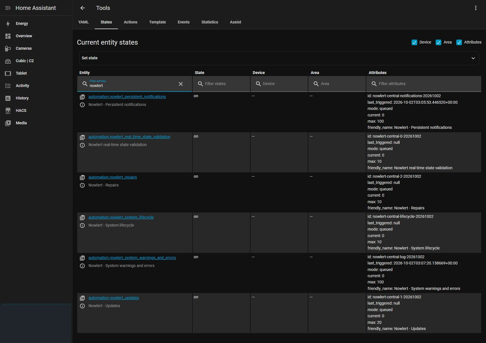
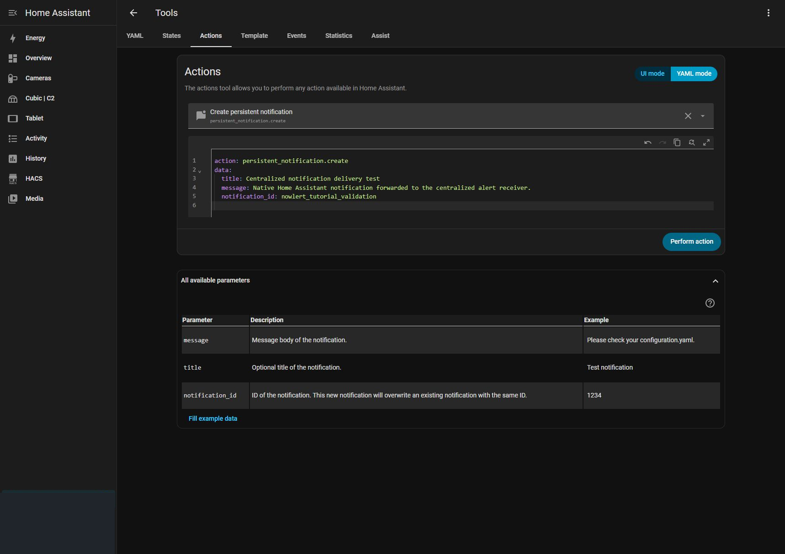
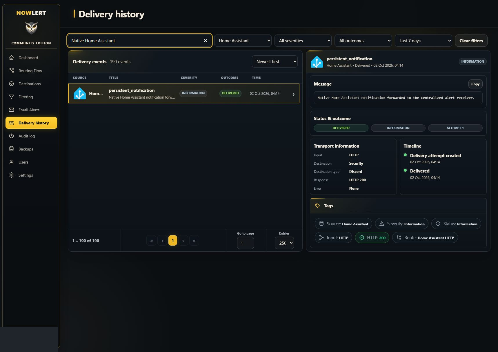
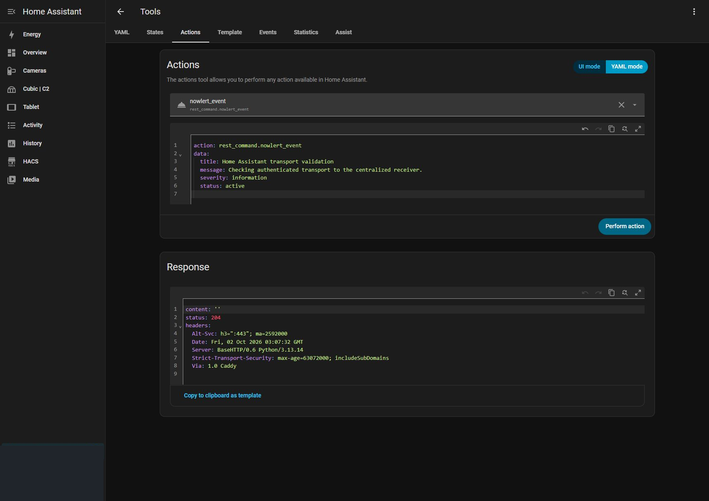

# Home Assistant alerts to Nowlert and Discord

This walkthrough was configured and tested on 2 October 2026. Home Assistant
sent a native persistent notification and real integration errors to Nowlert;
Delivery history shows the **Home Assistant HTTP** route, **Security** destination,
and Discord **HTTP 200**. Replace local names and addresses with your deployment.

## 1. Assign the built-in route

In Nowlert **Destinations**, edit your destination, open **Manage routes**, select
**Home Assistant HTTP**, then save. The demonstrated destination is Security.
Routing lives in the WebUI database; do not recreate old output/routing YAML.

## 2. Issue a scoped token

In your Nowlert profile's API tokens, create an application token allowing only
**Home Assistant**, with 120 events/minute. Copy its one-time value privately.
Do not use an administrator token or put the token in the URL.

Add to Home Assistant's `secrets.yaml`:

```yaml
nowlert_home_assistant_token: "PASTE_SOURCE_SCOPED_TOKEN_HERE"
```

Add the reusable `rest_command.nowlert_event` from the
[Home Assistant integration reference](../home-assistant.md) to
`configuration.yaml`. Set its URL to
`https://YOUR_NOWLERT_HOST/home-assistant/events`. Keep `X-Nowlert-Token` as a
`!secret` reference. Merge into existing `rest_command` and `system_log` sections;
do not create duplicate top-level keys or overwrite existing commands.

```yaml
system_log:
  fire_event: true
```

## 3. Forward the supported alert streams

Append the [five ready-to-use automations](../examples/home-assistant-central-alerts.yaml)
to `automations.yaml`. Preserve existing automations. They forward:

| Stream | Coverage |
|---|---|
| System log | Warning and error events, excluding transport errors to prevent recursion |
| Updates | Available/completed transitions for every `update.*` entity |
| Repairs | Issue creation/removal events |
| Persistent notifications | Added, updated, removed, and current notifications |
| Lifecycle | Home Assistant startup and shutdown |

The tested installation also has a sixth automation for its existing validation
helper. That deployment-specific helper is not required by the downloadable file.



Use **Settings → Tools → YAML → Check configuration**. Reload **RESTful Command**
and **Automations**. Changing an integration setting such as `system_log.fire_event`
may require a restart; it was already enabled in the tested installation. Check
that the new automation entities are **on**.

This forwards supported alert streams, not every sensor state or arbitrary event
on the Home Assistant event bus. Add purpose-built automations using the same REST
command for other events. Repairs uses an internal registry event and should be
rechecked after Home Assistant upgrades. Queue and token limits still apply.

## 4. Run a native test

In **Settings → Tools → Actions**, switch to YAML and run:

```yaml
action: persistent_notification.create
data:
  title: Centralized notification delivery test
  message: Native Home Assistant notification forwarded to the centralized alert receiver.
  notification_id: nowlert_tutorial_validation
```



Open Nowlert **Delivery history**, filter Home Assistant, and select the event.
Confirm Input **HTTP**, destination **Security** (or yours), route
**Home Assistant HTTP**, outcome **Delivered**, and response **HTTP 200**.



A direct `rest_command.nowlert_event` test also returns HTTP 204 when the receiver
accepts the payload. This is receiver acceptance, separate from destination delivery.



Dismiss only the disposable test notification afterward:

```yaml
action: persistent_notification.dismiss
data:
  notification_id: nowlert_tutorial_validation
```

## Troubleshooting

- HTTP 401/403: check the scoped token, source permission, and secret reference.
- HTTP 400: inspect the payload contract. A persistent notification ID is **not**
  a Home Assistant entity ID; leave `entity_id` empty for notification events.
- No log events: verify `system_log.fire_event` and enabled automations. This
  stream emits warnings/errors, not informational log entries.
- Recursive automation errors: use the current example's logger guard as the
  first queued action. Avoid rendering a log-forwarding guard in automation
  conditions while another template is logging an error. The update example
  also tolerates state events without `from_state` or `to_state`.
- Repeated iLO session lifecycle alerts: an `hp_ilo` sensor platform can query
  the controller separately for each metric. Set `scan_interval: 300` on that
  platform if five-minute metric updates are sufficient. Native Redfish alert
  subscriptions remain independent; filter unwanted session lifecycle messages
  in Nowlert rather than disabling hardware alerts.
- Accepted but not delivered: check route assignment and centralized destination
  filtering. Keep source alert collection broad and manage noise in Nowlert.
- Network/TLS errors: the Home Assistant server must resolve and reach the URL;
  test from that server, not only from your browser.

See Home Assistant's official [REST command](https://www.home-assistant.io/integrations/rest_command/),
[system log](https://www.home-assistant.io/integrations/system_log/), and
[persistent notification](https://www.home-assistant.io/integrations/persistent_notification/)
documentation.
