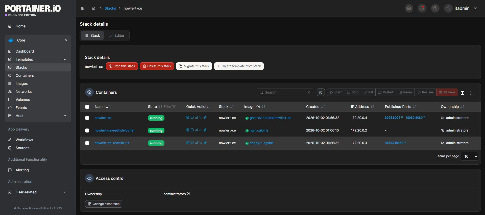
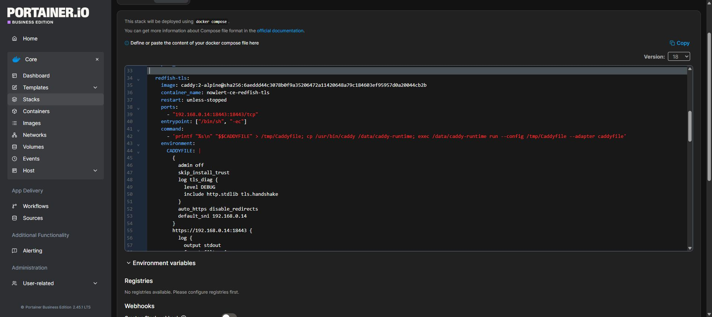
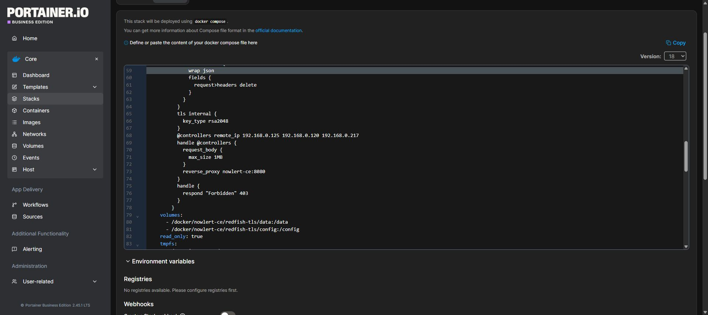
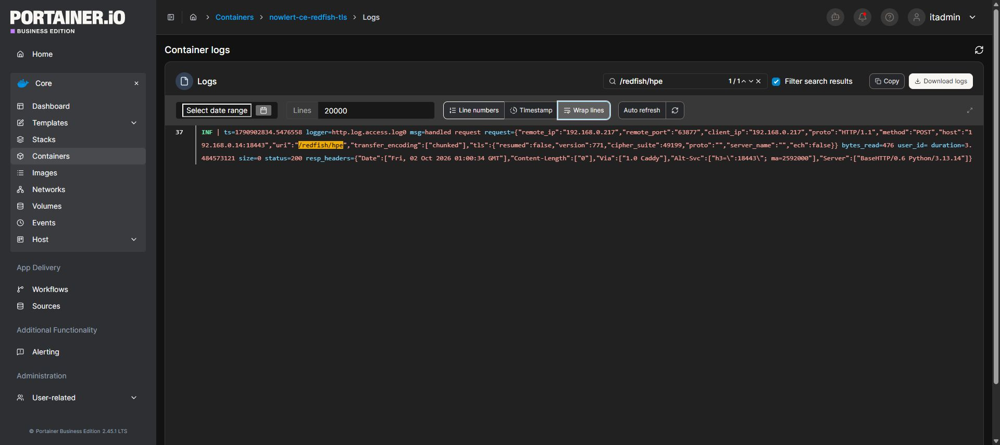

# Configure the local HTTPS callback used by the iLO4 tutorial

This deployment note documents the dedicated listener used for the verified
iLO4 2.81 test. It complements the [illustrated Redfish tutorial](hardware-redfish-setup.md).
It is an instance configuration, not a service automatically created by the
Nowlert image. Prefer your existing HTTPS receiver if the controller can use it.

The tested path was:

```text
iLO4 → 192.168.0.14:18443 (Caddy TLS) → nowlert-ce:8080 → Discord
```

The iLO4 client did not send SNI. The listener selected a default RSA certificate
and forwarded the chunked request directly to the patched Nowlert image. The
temporary buffering service remained present in the existing stack but was not
part of this verified path.

## 1. Use an image containing the native fix

The immutable image tested on 2 October 2026 was:

```text
ghcr.io/theriark/nowlert-ce@sha256:41f95e7935dbfc891947dc866dec376ef257785da639e03010a4e4db27e208b0
```

This is the development build from commit
`d1daf765b4c98a40f884610d75c97b1f4dfb7b51`. Stage/stable had not been promoted
when this guide was captured. Check the release notes before choosing a later
release. The image includes bounded chunked-body decoding and HTTP 200 responses
for accepted iLO events; it does not install TLS certificates or controller subscriptions.

## 2. Add the listener to the existing Portainer stack

Open **Stacks → nowlert-ce → Editor**. Preserve the existing services and named
volumes. The following is the additional `redfish-tls` service used in the local
test; merge it under the existing `services:` mapping. It assumes the Nowlert
service is named `nowlert-ce` and both services use the same Compose network.

Replace the Docker host address and controller addresses everywhere they appear.
Keep the bind directories on the Docker host, not on the computer running the
browser. The tested base directory was `/docker/nowlert-ce`.

```yaml
  redfish-tls:
    image: caddy:2-alpine@sha256:6aeddd44c3078b0f9a35206472a11420648a79c184603ef95957d0a20044cb2b
    container_name: nowlert-ce-redfish-tls
    restart: unless-stopped
    ports:
      - "192.168.0.14:18443:18443/tcp"
    entrypoint: ["/bin/sh", "-ec"]
    command:
      - 'printf "%s\n" "$$CADDYFILE" > /tmp/Caddyfile; cp /usr/bin/caddy /data/caddy-runtime; exec /data/caddy-runtime run --config /tmp/Caddyfile --adapter caddyfile'
    environment:
      CADDYFILE: |
        {
          admin off
          skip_install_trust
          auto_https disable_redirects
          default_sni 192.168.0.14
        }
        https://192.168.0.14:18443 {
          log {
            output stdout
            format filter {
              wrap json
              fields {
                request>headers delete
              }
            }
          }
          tls internal {
            key_type rsa2048
          }
          @controllers remote_ip 192.168.0.125 192.168.0.120 192.168.0.217
          handle @controllers {
            request_body {
              max_size 1MB
            }
            reverse_proxy nowlert-ce:8080
          }
          handle {
            respond "Forbidden" 403
          }
        }
    volumes:
      - /docker/nowlert-ce/redfish-tls/data:/data
      - /docker/nowlert-ce/redfish-tls/config:/config
    read_only: true
    tmpfs:
      - /tmp:size=16m,mode=1777
    cap_drop: [ALL]
    security_opt: [no-new-privileges:true]
    pids_limit: 64
```

The copied Caddy binary avoids a file-capability execution failure observed when
dropping all container capabilities. The published listener uses the unprivileged
port 18443. Request headers are excluded from access logs to avoid logging tokens.
The live troubleshooting configuration also enabled TLS handshake diagnostics;
they are optional and omitted from this normal-use example.

This example issues an internal certificate. Confirm trust and compatibility with
your controller before relying on it. It does not establish compatibility with
iDRAC8 or the older Supermicro controller; their callback tests remain unresolved.







## 3. Apply and verify

1. Review the merged stack and its existing data mounts, then choose **Update the stack**.
2. Wait for Nowlert and the TLS listener to show **running**.
3. Create the iLO subscription with callback
   `https://<docker-host>:18443/redfish/hpe` and the source-scoped token.
4. Send the synthetic iLO event described in the Redfish tutorial.
5. Check the listener's access log for the actual controller IP, POST path,
   `transfer_encoding: ["chunked"]`, and status **200**.
6. Check Nowlert Delivery history for the Discord result, then read the subscription
   again after the retry window.



HTTP 200 at the receiver and HTTP 200 from Discord are separate results. The first
acknowledges the controller request; the second confirms output delivery. Both
were observed in the local test. No change to the main website's TLS listener
was needed for this dedicated callback.
