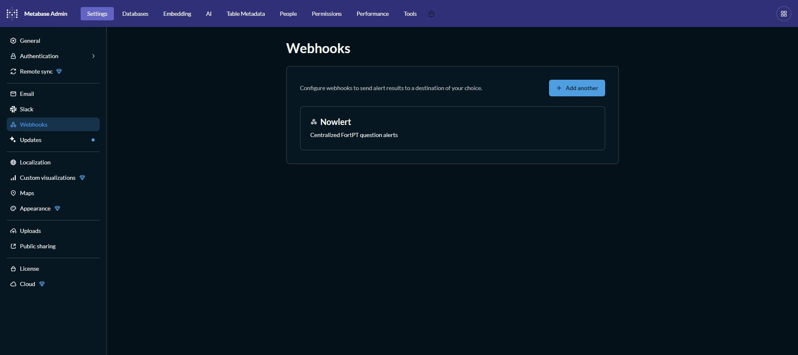
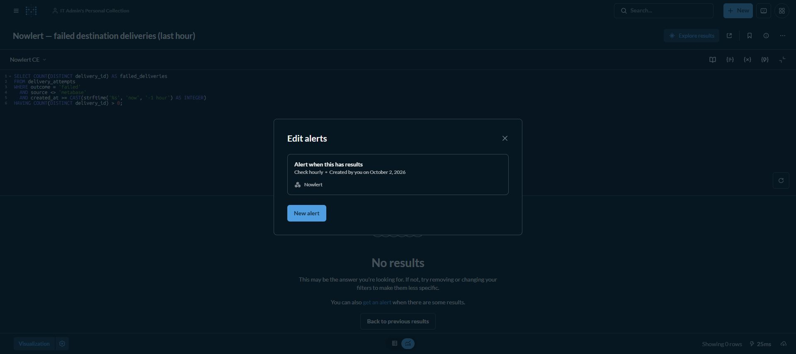
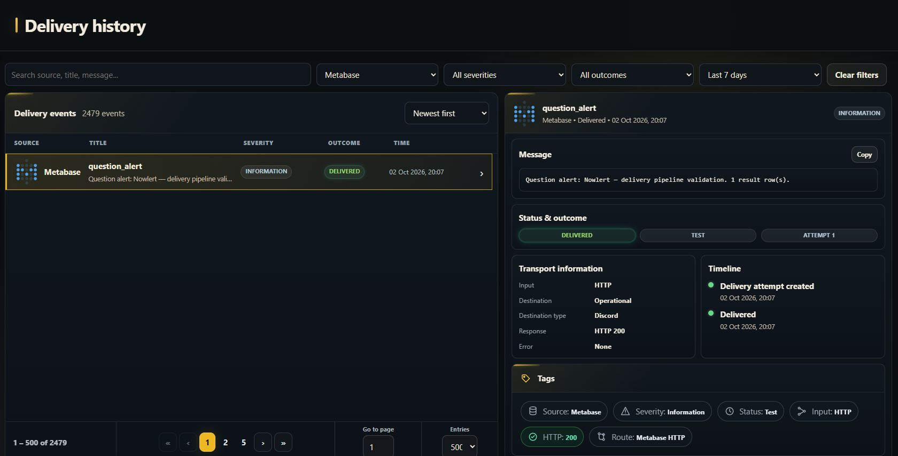

# Metabase question alerts to Nowlert

Tested with **Metabase 0.63.18.2**. The Nowlert webhook and a real operational
question alert are saved. The hourly check suppresses healthy empty results;
see the exact condition and validation limits below.

Complete [Nowlert setup](application-notification-setup.md) for **Metabase HTTP**,
scope `metabase`. Use the documented development image or later: it includes
the fix for Metabase's native empty connection probe.

## Allow the private callback when needed

For a self-hosted Nowlert on a private LAN, Metabase's default HTTP-channel host
policy may block the callback. The local deployment persists this setting on
the **Metabase application service**:

```yaml
environment:
  MB_HTTP_CHANNEL_HOST_STRATEGY: allow-private
```

Merge it with existing environment variables/env files and recreate only the
Metabase app service. Preserve its application database and volumes. This
permits private destinations while retaining loopback/metadata protections;
it does not disable certificate verification. Skip this change for an already
permitted public HTTPS endpoint. Install a trusted internal CA if necessary.

## Save the webhook destination

Open **Admin → Settings → Webhooks → Add a webhook**:

| Field | Value |
|---|---|
| Name | Nowlert |
| Description | Centralized question alerts |
| URL | `https://YOUR_NOWLERT/metabase/alerts` |
| Authentication | Bearer |
| Token | `YOUR_METABASE_TOKEN` |

Select **Send a test**. After Success, save the destination. The local saved
destination appears here; its token is excluded:



**This connection test sends an empty authenticated POST.** Nowlert acknowledges
it with HTTP 204 without creating an event or destination delivery. An empty
Delivery history after this test is expected. A question-alert test is a
different request with an alert payload.

## Create the first real question alert

The local installation now monitors **failed Nowlert destination deliveries in
the last hour**, using the connected read-only **Nowlert CE** database:

```sql
SELECT COUNT(DISTINCT delivery_id) AS failed_deliveries
FROM delivery_attempts
WHERE outcome = 'failed'
  AND source <> 'metabase'
  AND created_at >= CAST(strftime('%s', 'now', '-1 hour') AS INTEGER)
HAVING COUNT(DISTINCT delivery_id) > 0;
```

Save as **Nowlert — failed destination deliveries (last hour)**. Create an alert
**When this question has results**, check **hourly**, at minute **0**, recipient
**Nowlert**. Keep “Delete this Alert after it's triggered” off. The HAVING clause
is essential: an unconditional COUNT returns a row even at zero and would alert
while healthy. Excluding Metabase avoids a recursive failure-alert loop.



The first native scheduled evaluation and Send now evaluation returned no rows
and were skipped as empty. That verifies healthy suppression; it is not proof
of a failure alert reaching Discord. This query counts failed attempts, including
those whose later retry succeeds; use it to investigate destination reliability.
Metabase does not emit an automatic recovery webhook when the result clears.

A separate **Nowlert — delivery pipeline validation** question counts actual
successful deliveries. Its native **Send now** test reached the Operational
Discord destination with **HTTP 200**, recorded as **Test / Delivered** at 20:07
on 2 October 2026. No recurring alert was saved for that validation question.
This verifies the native payload and destination path without inventing a
production failure or changing the hourly failure alert.



For another operational data source:

1. Connect the actual data source and save a question with meaningful operational
   results. An initial example is a question returning failed operations; the
   required data must already exist in your connected database.
2. Open that saved question and create an alert. Choose its condition and
   evaluation schedule according to the result you want to detect.
3. Select the **Nowlert** webhook as the recipient and save the alert.
4. Exercise the alert with known matching data or its native alert test. Match
   the event time/question in Nowlert Delivery history and verify the destination
   message. Record that evidence before advertising end-to-end delivery.

Keep the business/question condition in Metabase: it determines when an alert
exists. Use Nowlert for destination routing and notification noise suppression.
The webhook covers **question alerts**, not dashboard subscriptions or general
database/server health monitoring. Do not invent sample-dashboard alerts solely
to demonstrate connectivity.

## Troubleshooting and filtering

If saving fails with a private-host error, check the host policy above. If the
empty test returns 400, check that the running Nowlert image includes the probe
fix. HTTP 401 means authentication or source scope needs correction. If the
connection test succeeds but no alerts arrive, confirm a saved question alert
actually selects this webhook and its condition/schedule has been met.

Filter by question name/ID, alert ID, creator, status or severity. Normalized
events include row count, not raw query rows or base64 chart images.

References: [Metabase webhooks](https://www.metabase.com/docs/latest/configuring-metabase/webhooks),
[HTTP channel host policy](https://www.metabase.com/docs/latest/configuring-metabase/environment-variables#mb_http_channel_host_strategy),
[receiver details](../metabase.md).

[All infrastructure tutorials](infrastructure-tutorials.md)
