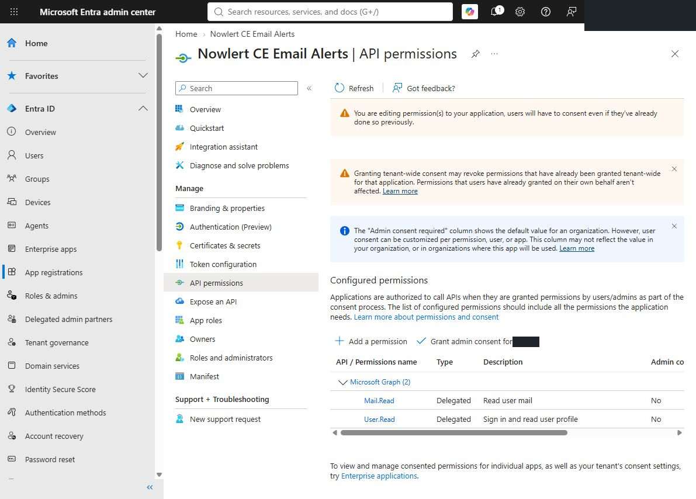

# Microsoft 365 and Outlook email alerts in Nowlert CE

Connect a Microsoft mailbox using delegated Microsoft Graph access, then classify
No-IP and status emails before routing them to your destinations. Each mailbox
owner authorizes their own mailbox. The deployment's application certificate or
client secret authenticates Nowlert to Microsoft; it does not authorize access
to every mailbox in the tenant.

## Before you start

Use a Nowlert build containing Email Alerts and the authentication method you
intend to use. Certificate authentication must be present in the deployed build;
a local development validation does not establish support in an older stable image.

You need access to the intended Microsoft Entra tenant's **App registrations**,
the mailbox to monitor, a reachable Nowlert HTTPS URL, and outbound container
HTTPS access to Microsoft login and Graph endpoints. Work/school tenant policies
may require an administrator to approve delegated access.

The examples use `https://nowlert.example.com/ui/` as the callback. Replace the
hostname consistently, keeping the `/ui/` path and trailing slash.

## 1. Register the Microsoft application

1. In **Microsoft Entra → App registrations**, create or reuse a dedicated
   Nowlert application in the **tenant that owns the intended mailbox**.
2. Choose the supported account audience. A single-tenant work mailbox normally
   uses its own directory. Personal Outlook accounts require an audience that
   includes personal Microsoft accounts. Match the configured authority to that
   audience; do not use a different organization's tenant just because you are
   already signed in there.
3. In **Authentication**, add the **Web** platform and the exact callback
   `https://nowlert.example.com/ui/`. This is a server-side OAuth flow.
4. In **API permissions → Add a permission → Microsoft Graph → Delegated
   permissions**, add **Mail.Read**. Nowlert's consent flow also requests
   `openid profile email offline_access` for sign-in and token refresh.
5. Follow your tenant's consent policy. Use delegated permissions for this
   mailbox flow; do not add application-wide mailbox access or `Mail.Send`.



The captured application also lists its existing delegated `User.Read`
permission. The important mailbox permission is delegated `Mail.Read`.
See Microsoft's [Web redirect setup](https://learn.microsoft.com/en-us/entra/identity-platform/how-to-add-redirect-uri)
and [account audience configuration](https://learn.microsoft.com/en-us/entra/identity-platform/msal-client-application-configuration).

## 2. Configure the application credential

Use one of the following methods. Both use the same delegated mailbox consent.

### Certificate method used in the validated installation

1. Generate a matching RSA private key and PEM X.509 certificate in the host's
   restricted secrets directory. Retain existing credentials during rotation.
   For a **new pair**, with neither filename already present:

   ```sh
   umask 077
   test ! -e nowlert_email_microsoft_private_key &&
   test ! -e nowlert_email_microsoft_certificate &&
   openssl req -x509 -newkey rsa:3072 -sha256 -days 365 -nodes \
     -subj '/CN=Nowlert CE Email Alerts' \
     -keyout nowlert_email_microsoft_private_key \
     -out nowlert_email_microsoft_certificate
   ```

2. Set both files to mode `0600` and ownership readable by the running container's
   service UID/GID. Keep the directory traversable by that identity and mount it
   read-only. Do not make the private key world-readable.
3. In Entra **Certificates & secrets → Certificates → Upload certificate**, upload
   only the **public certificate**. The private key stays on the Docker host.
4. Add these variables to the existing Nowlert service:

   ```yaml
   environment:
     NOWLERT_EMAIL_MICROSOFT_CLIENT_ID: YOUR_APPLICATION_CLIENT_ID
     NOWLERT_EMAIL_MICROSOFT_TENANT_ID: YOUR_DIRECTORY_TENANT_ID
     NOWLERT_EMAIL_MICROSOFT_CERTIFICATE_FILE: /run/secrets/nowlert_email_microsoft_certificate
     NOWLERT_EMAIL_MICROSOFT_PRIVATE_KEY_FILE: /run/secrets/nowlert_email_microsoft_private_key
     NOWLERT_EMAIL_MICROSOFT_REDIRECT_URI: https://nowlert.example.com/ui/
   ```

Certificate configuration takes precedence over a client secret. Invalid,
expired or mismatched certificate material fails closed; it does not silently
fall back to a client secret. Rotate before expiry by uploading the new public
certificate, replacing the mounted pair and verifying synchronization before
removing the old credential. See [Microsoft certificate credentials](https://learn.microsoft.com/en-us/entra/identity-platform/certificate-credentials).

### Client-secret alternative

If your tenant permits it, create an application client secret under
**Certificates & secrets**. Store its **value**, not its secret ID, in the protected
host file mounted at `/run/secrets/nowlert_email_microsoft_client_secret`.

```yaml
environment:
  NOWLERT_EMAIL_MICROSOFT_CLIENT_ID: YOUR_APPLICATION_CLIENT_ID
  NOWLERT_EMAIL_MICROSOFT_TENANT_ID: YOUR_DIRECTORY_TENANT_ID
  NOWLERT_EMAIL_MICROSOFT_CLIENT_SECRET_FILE: /run/secrets/nowlert_email_microsoft_client_secret
  NOWLERT_EMAIL_MICROSOFT_REDIRECT_URI: https://nowlert.example.com/ui/
```

Recreate the existing Nowlert service to load configuration, preserving its
image, persistent state, volumes, networks and ports. Configure expiry/rotation
for whichever credential method you use. See [deployment OAuth configuration](../deployment.md#email-alerts-oauth-applications).

## 3. Connect and synchronize the mailbox

1. Open **Email Alerts → Mailboxes → + Connect mailbox**.
2. Select **Microsoft 365 / Outlook**, enter the mailbox name and address, and
   select the appropriate visibility.
3. Continue to Microsoft's sign-in screen. Select the intended mailbox account,
   review the delegated permissions and complete consent. The account's password
   is entered only on Microsoft's sign-in page.
4. On return, confirm **Credentials configured**, **Healthy**, and a recent
   **Last sync**. Click **Sync now** to verify another synchronization.
5. Open the mailbox's **Edit** form and choose folders that include the notices
   you want classified. Private visibility does not make the mailbox available
   to other Nowlert users.


## 4. Configure rules and delivery

Use the [shared No-IP and OpenAI rule walkthrough](gmail-microsoft-email-alerts.md#no-ip-and-openai-status-rules).
Rules can cover both connected providers for the same owner. A mailbox condition
can restrict a rule to one connection when needed.

Assign **Email Alerts** under the destination's **Manage routes**, click **Done**,
and save the destination. Verify its centralized filters permit the intended
classifications. Check a representative message in **Email Alerts → Activity**,
then confirm the corresponding successful response in **Delivery history**.

The local validation on **4 October 2026** confirmed Microsoft certificate-based
OAuth and healthy mailbox synchronization. A real stored No-IP message also
matched the warning rule. These checks establish connection and classification;
they do not establish a native OpenAI incident/resolution pair or a destination
delivery capture for this email walkthrough.

## Troubleshooting

| Symptom | Check |
|---|---|
| Provider not configured | Client ID, correct tenant, readable credential files and service recreation. |
| Wrong tenant/account at sign-in | Intended directory, supported account audience and configured tenant authority. |
| Redirect mismatch | Web-platform callback exactly matches Nowlert, including `/ui/` and the trailing slash. |
| Tenant blocks client secrets | Use a supported certificate build and upload only the public certificate. |
| Certificate authentication fails | Matching certificate/key, validity dates, correct Entra application and file ownership. |
| Consent requires an administrator | Follow the tenant's delegated-consent policy; application-wide access is not a workaround. |
| No matching activity | Selected folders, actual sender/subject conditions, enabled rule and ownership. |
| Activity matches but delivery is absent | Email Alerts route, group delivery configuration, filters and Delivery history. |
