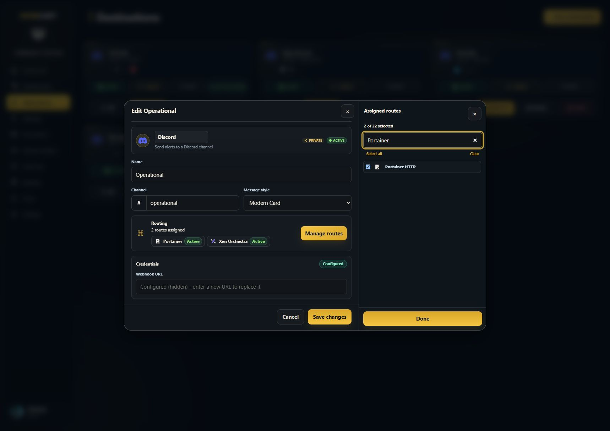
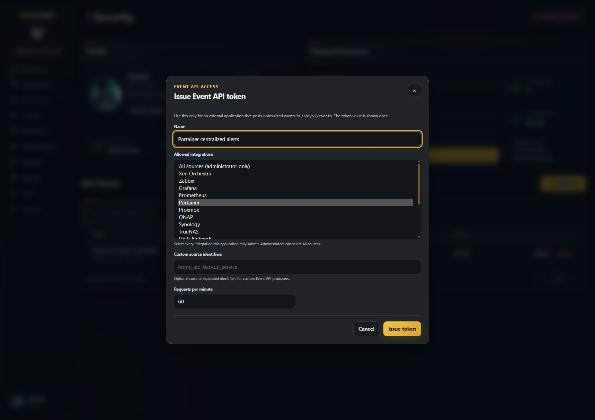
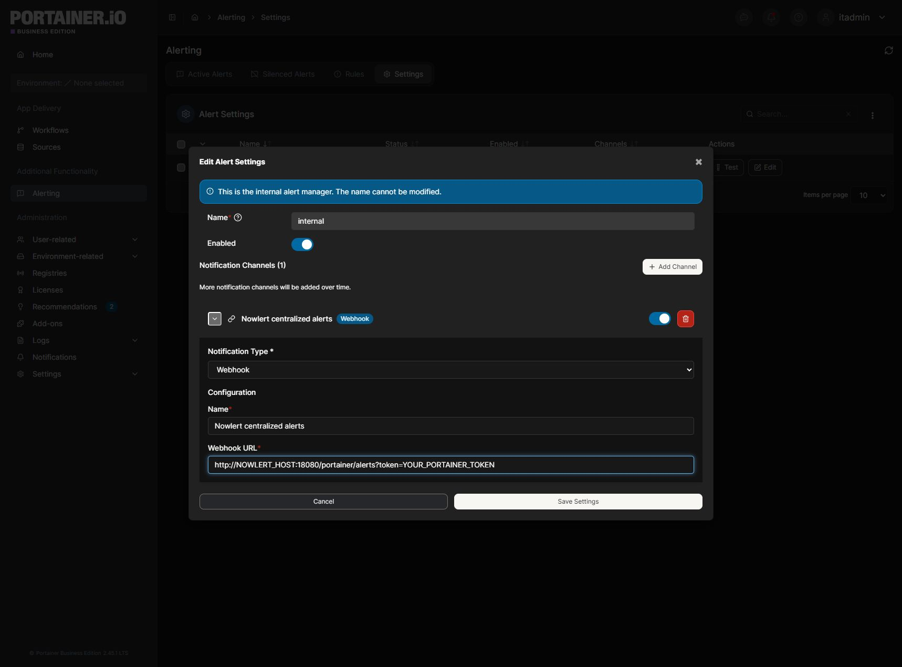
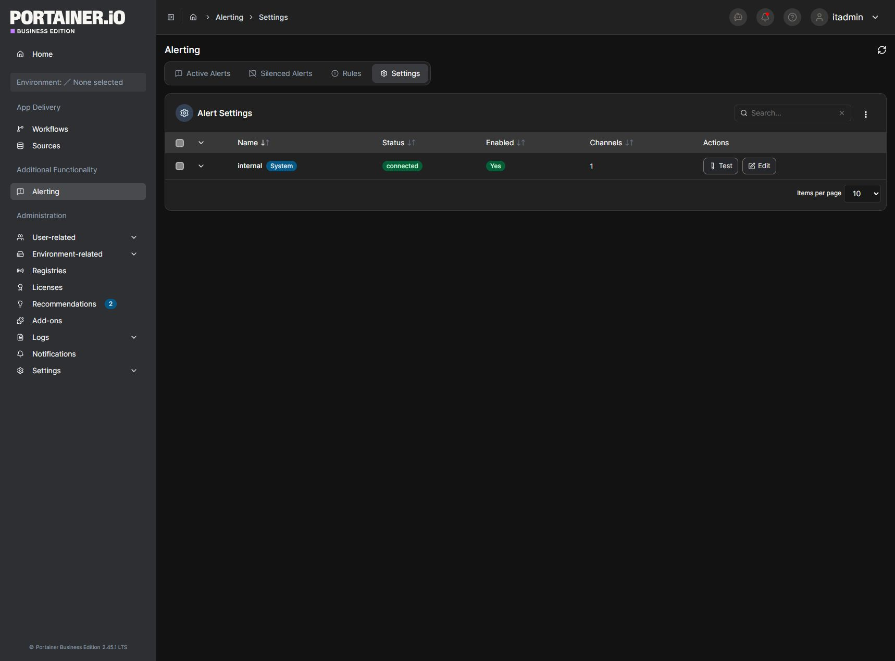
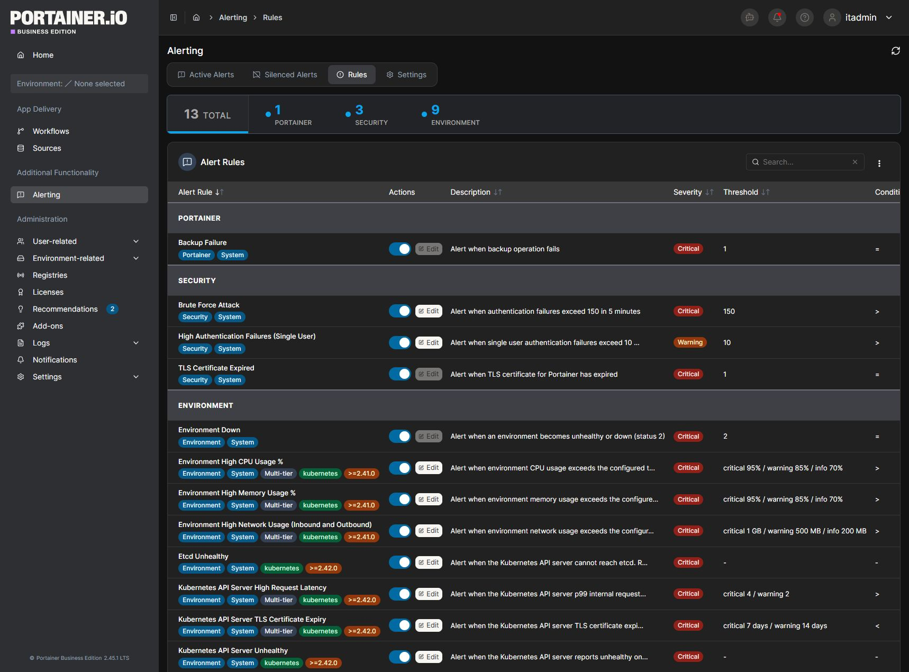
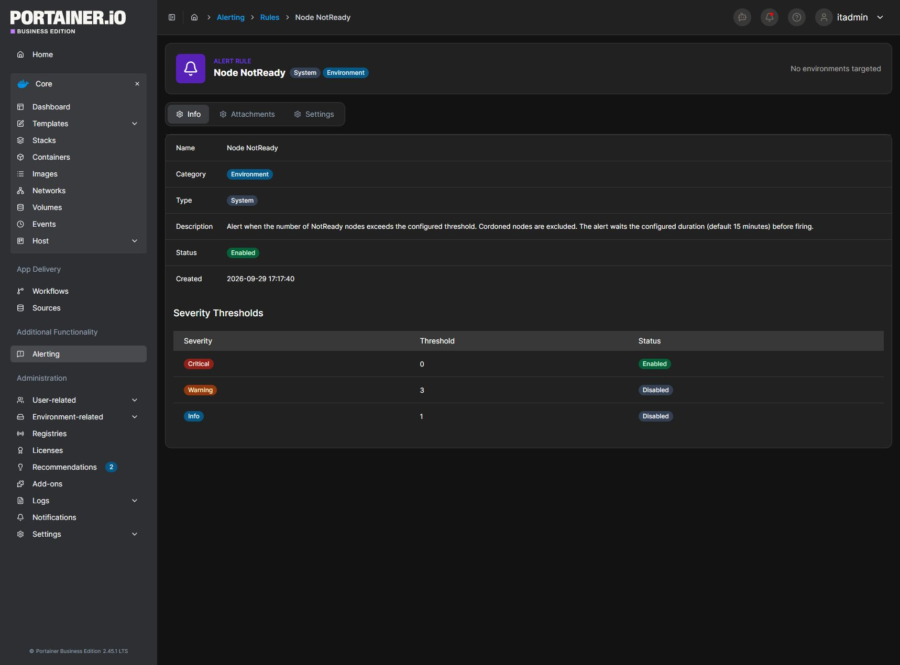
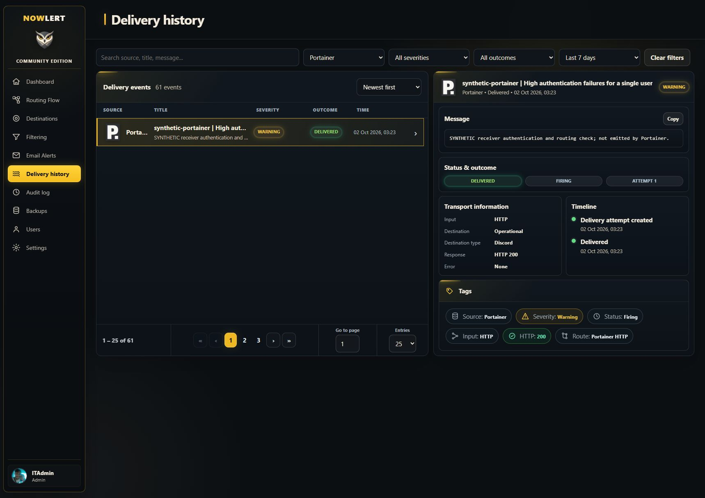
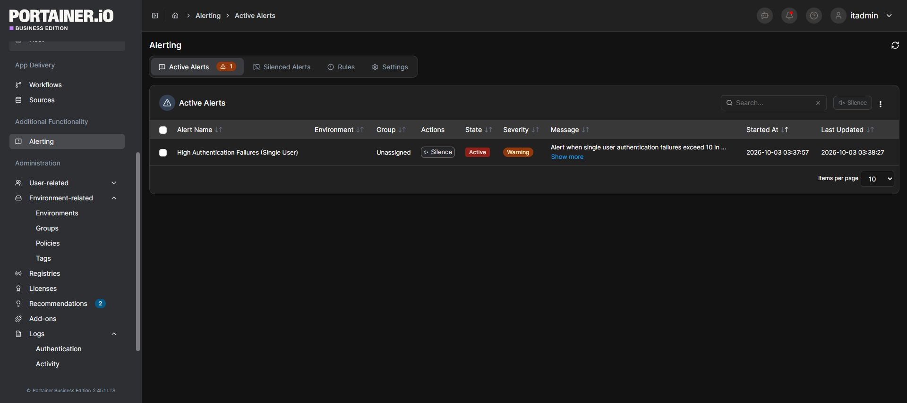
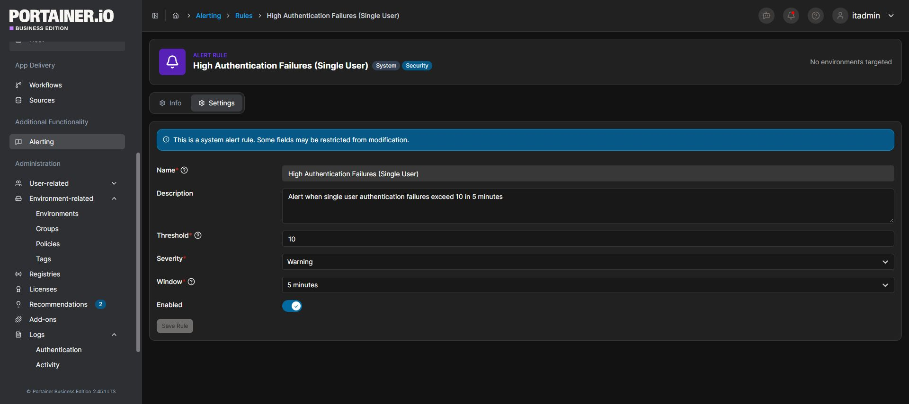
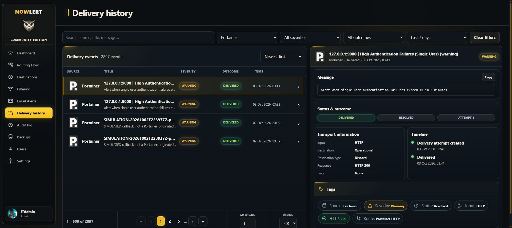

# Send Portainer alerts to Nowlert and Discord

Portainer Business Edition sends its native Alerting notifications to Nowlert's
HTTP receiver. Assign the built-in **Portainer HTTP** route to a destination,
enable every applicable Portainer alert rule, and choose delivery policies in
Nowlert's centralized **Filtering** page.

```text
Portainer alert rule → internal Alertmanager → authenticated webhook
→ Nowlert Portainer HTTP route → destination filtering → Discord
```

## Requirements

- Portainer Business Edition with native Alerting; the illustrated installation
  runs 2.45.1 LTS.
- A Nowlert image containing commit `f6e69534435e85c026ae2be1b90766f2c5727fc8`
  or later. This fixes URL tokens being ignored by scoped Portainer authentication.
- Connectivity from the Portainer server to the published Nowlert HTTP listener.

## 1. Assign the Portainer route

In Nowlert, edit the desired destination, open **Manage routes**, select
**Portainer HTTP**, choose **Done**, and save. This local installation uses the
existing **Operational** Discord destination. Leave centralized filtering at
the desired delivery policy; do not narrow the source subscription by severity.



## 2. Issue a scoped token

Open your profile menu → **Security** → **New token**. Name it
`Portainer centralized alerts`, select only **Portainer**, and choose an
appropriate rate limit. The example uses 60 requests per minute. Issue the
token and save the one-time value privately.



The token authorizes event submission for Portainer, not administrator API access.
The same token works on the native Portainer receiver in the fixed image.

## 3. Configure the webhook channel

In Portainer, open **Alerting → Settings**, edit the **internal** alert manager,
enable it, and add an enabled **Webhook** notification channel:

| Field | Example |
|---|---|
| Name | Nowlert centralized alerts |
| Notification type | Webhook |
| URL | `http://NOWLERT_HOST:18080/portainer/alerts?token=YOUR_PORTAINER_TOKEN` |

Use the actual published HTTP port, not the SMTP port. Portainer's channel
accepts a URL and cannot supply the token header. Keep this direct HTTP callback
on a trusted private network; use a compatible HTTPS listener when crossing a
network boundary. Keep the token out of public screenshots and proxy query logs.



The screenshot uses an unsaved placeholder URL to keep the real token private.

Choose **Save Settings**. The alert manager must show **connected**, **Enabled:
Yes**, and the configured channel count. Its **Test** action checks manager
reachability; it does not emit a webhook notification.



## 4. Enable all applicable rules

Open **Alerting → Rules**, set **Items per page** to **All**, and enable every
supported rule. The local 2.45.1 installation exposes 13 rules:

- Backup Failure, Brute Force Attack, High Authentication Failures (Single User),
  TLS Certificate Expired, and Environment Down.
- Environment High CPU, Memory, and Network Usage.
- Etcd Unhealthy, Kubernetes API High Request Latency, TLS Certificate Expiry,
  Kubernetes API Unhealthy, and Node NotReady.





Kubernetes rules require a compatible Kubernetes environment; enabling them on
a Docker-only installation does not create Kubernetes telemetry. Thresholds and
evaluation periods still determine when Portainer emits an alert. Check
**Silenced Alerts** for source-side suppression; this installation had none.

Native Alerting is not a complete Docker event or Portainer audit-log export.
Enabling all rules forwards the available alert stream, not every container
start/stop action or every raw metric sample. Nowlert can filter only events
that the source emits. Keep firing and resolved notifications available.

## 5. Verify delivery

Check **Active Alerts** in Portainer and **Delivery history** in Nowlert for the
same alert. Inspect the destination response and verify receipt in Discord.
A receiver-generated synthetic test proves authentication and routing but does
not prove that Portainer emitted the callback. Do not label the manager's
reachability Test as end-to-end delivery proof.

### Local receiver and routing check

The fixed development image was deployed by immutable digest
`sha256:797aee5c3962d2746da23fab3558a60bb6748579ea437aec0584f97b68eaafb9`.
A clearly labelled synthetic Portainer envelope returned HTTP 204 and was
delivered to Operational through Portainer HTTP, attempt 1, Discord HTTP 200.
This verifies the receiver and destination path; it is not a Portainer-originated
alert.



### Verified native rule emission: 3 October 2026

A controlled check temporarily set **High Authentication Failures (Single User)**
to a positive threshold of **1**, retaining its five-minute window and Warning
severity. Two deliberately invalid logins for the existing administrator caused
Portainer to create an active alert. No password or production workload changed.



Nowlert recorded **High Authentication Failures (Single User) [warning]** as
`firing`, delivered with destination HTTP **200**, at Unix timestamp
`1790995110`. This was emitted by Portainer's native evaluator, not submitted
directly to the receiver. The [token-free delivery record](../images/monitoring-setup/records/portainer-native-validation.json)
contains the evidence.

The threshold was restored to **10** over **5 minutes**, still enabled. Use
temporary thresholds only in an approved controlled test; restore the saved
production values immediately afterwards. The earlier nonexistent-user and
zero-threshold checks did not establish native emission.



After restoration, Portainer emitted the matching `resolved` callback. Nowlert
delivered it with HTTP **200** at Unix timestamp `1790995291`. Both native
lifecycle deliveries are present in the record above.



## Troubleshooting

| Symptom | Check |
|---|---|
| HTTP 401 | Use the Portainer-scoped token and the image containing the URL-token fix. Do not disable authentication. |
| HTTP 400 | Send the native Portainer Alerting envelope, not a stack deployment webhook or arbitrary Alertmanager JSON. |
| Manager connected, no events | Check enabled rules, thresholds, evaluation periods, environment compatibility, and silences. |
| Event received, no destination delivery | Check Portainer HTTP assignment and centralized destination filtering. |
| Connection timeout | Test reachability from the Portainer server to the published HTTP port. |

See the [integration reference](../portainer.md) and the
[event coverage audit](centralized-event-coverage.md).
