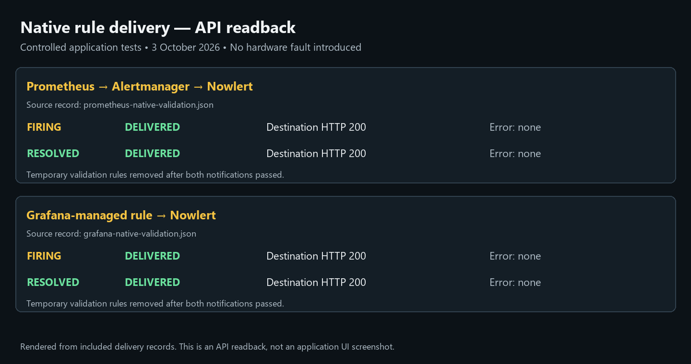

# Prometheus through Alertmanager to Nowlert CE

Prometheus evaluates alert rules; Alertmanager sends the native webhook to
Nowlert. Nowlert then applies its assigned route and centralized filters.
Validated on 3 October 2026 with Prometheus 3.15.0, Alertmanager 0.34.1, and
Nowlert development image `sha-abdc92887fc508bf1f105697eb48772acda78b08`.

## Prepare Nowlert and Alertmanager

1. Follow [shared application setup](application-notification-setup.md).
2. Issue an application token scoped only to **Prometheus**. Our local example
   uses 300 requests per minute, with no administrator access.
3. Assign the existing **Prometheus HTTP** route to your destination. The local
   example uses **Operational**; no new integration or route was created.
4. Use your existing Alertmanager, or deploy one if none exists. Keep its API
   private. Our example connects it to the existing telemetry Docker network
   and binds its host API only to `127.0.0.1:19093`.

Store the token in a private file readable by Alertmanager, mounted read-only.
Do not commit the token or embed it in the callback URL.

```yaml
global:
  resolve_timeout: 5m
route:
  receiver: nowlert-ce
  group_by: [alertname, instance]
  group_wait: 10s
  group_interval: 30s
  repeat_interval: 4h
receivers:
  - name: nowlert-ce
    webhook_configs:
      - url: https://nowlert.example.com/prometheus/alerts
        send_resolved: true
        http_config:
          authorization:
            type: Bearer
            credentials_file: /etc/alertmanager/prometheus-token
```

Merge this receiver and routing into an existing configuration; do not overwrite
other receivers. Validate with `amtool check-config` before deploying.

## Connect Prometheus

Preserve existing scrape jobs. Add Alertmanager and your rule file to the
Prometheus configuration:

```yaml
alerting:
  alertmanagers:
    - static_configs:
        - targets: [nowlert-alertmanager:9093]
rule_files:
  - /prometheus/nowlert-rules.yml
```

The target must resolve from the Prometheus container. Validate the complete
configuration with `promtool check config`, then reload Prometheus using its
supported reload mechanism. In the local Docker deployment, this was SIGHUP.
Verify `/api/v1/alertmanagers` lists the receiver under `activeAlertmanagers`,
and check rule health in `/api/v1/rules`.

## Avoid duplicate conditions

Checkmk continues to own host/device monitoring in this installation. The only
permanent Prometheus rule added is its own configuration-reload failure:

```yaml
groups:
  - name: nowlert-prometheus-health
    rules:
      - alert: PrometheusConfigurationReloadFailed
        expr: prometheus_config_last_reload_successful == 0
        for: 2m
        labels:
          severity: warning
          notification_owner: prometheus
        annotations:
          summary: Prometheus configuration reload failed
          description: Prometheus rejected its most recent configuration reload.
```

This is distinct from Grafana's telemetry query-health rule. Do not forward a
second copy of a condition already evaluated by Checkmk or Grafana.

## Verify firing and recovery from Prometheus

Temporarily add a clearly labeled test alert using `expr: vector(1)` and
`for: 0s`. After Prometheus shows it firing and Nowlert records its delivery,
change its expression to `vector(0) > 0`. Verify the resolved notification, then
remove the disposable test rule and reload.

The local native test passed through **Prometheus → Alertmanager → Nowlert →
Operational**, delivering both firing and resolved notifications with HTTP 200.
The temporary rule was removed. The [token-free delivery readback](../images/monitoring-setup/records/prometheus-native-validation.json)
records these attempts. This validates the native evaluation/sending pipeline;
it does not claim a real hardware failure was introduced.

## Troubleshooting

- No active Alertmanager: inspect Docker DNS, network membership and the target.
- Alert fires but no callback: inspect Alertmanager routing and notification
  errors, token-file permissions, and receiver reachability.
- Recovery missing: keep `send_resolved: true` and inspect Nowlert filters.
- Duplicates: inspect overlapping rules, receivers, and Nowlert assignments.

See [Alertmanager's configuration reference](https://prometheus.io/docs/alerting/latest/configuration/).


