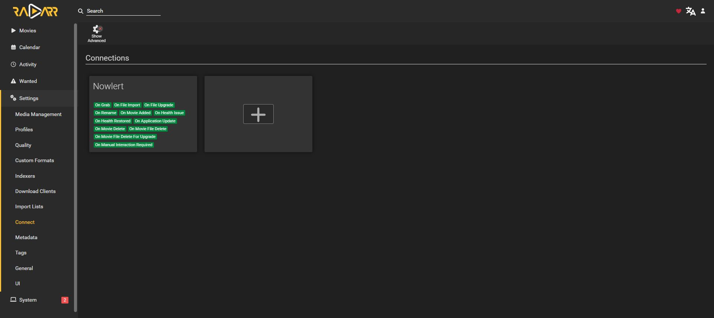

# Radarr notifications to Nowlert

Tested with **Radarr 6.4.4.10685**. The saved native Webhook connection sends all
available notification triggers to Nowlert. Two native tests were delivered to
the Operational destination. No additional script or monitoring agent is needed.

Complete [Nowlert setup](application-notification-setup.md) for **Radarr HTTP**,
scope `radarr`.

## Add the native webhook

Open **Settings → Connect → + → Webhook**. Show advanced settings if needed.

| Field | Value |
|---|---|
| Name | Nowlert |
| URL | `https://YOUR_NOWLERT/radarr/events` |
| Method | POST |
| Custom Headers key | `X-Nowlert-Token` |
| Custom Headers value | `YOUR_RADARR_TOKEN` |
| Tags | Empty, to include all media |
| Include Health Warnings | Enabled |
| Notification triggers | Enable every trigger offered by your version |

The configured version offers 12 triggers:
Grab, File Import, File Upgrade, Rename, Movie Added, Movie Delete, Movie File Delete, Movie File Delete For Upgrade, Health Issue, Health Restored, Application Update, Manual Interaction Required.

Click **Test**, then **Save**. Keep the authentication value private. The saved
connection card displays the enabled event types without displaying credentials:

## Verify the whole flow

The local native test was accepted by Nowlert with HTTP 204 and its Discord
delivery returned HTTP 200. For your installation, match the test time and
source in **Delivery history**, then inspect the destination message. The
application's successful Test only confirms the receiver responded successfully.

If Test fails, check HTTPS reachability from the application's host/container,
the custom header and token scope. If accepted but not delivered, check the
saved destination route assignment and central filters. If some events are
absent, check native trigger selection, media tags and Health Warnings.

## Filter noise in Nowlert

Keep the upstream triggers enabled. Suppress unwanted event types, media titles,
download-client messages or health warnings through Nowlert Filtering for the
destination. This covers notifications the Connect system emits; it does not
poll the queue or forward every application log entry.

[Payload and normalization details](../radarr.md) ·
[All infrastructure tutorials](infrastructure-tutorials.md)
