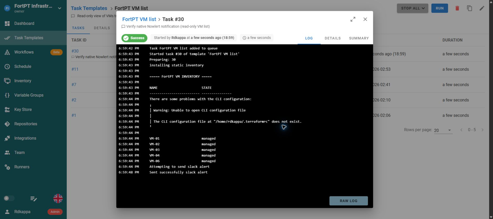

# Semaphore task results to Nowlert

Tested with **Semaphore 2.19.12**. Its native Slack-format provider sends task
results directly to Nowlert; no Slack workspace is required. A read-only VM-list
task completed successfully and its notification reached the Operational
destination. This reports task results, not raw Terraform telemetry.

Complete [Nowlert setup](application-notification-setup.md) for **Semaphore HTTP**,
scope `semaphore`.

## Configure the provider

Semaphore 2.19 uses server configuration plus project/template settings. Merge
these keys into its existing `config.json`; preserve database, encryption and
other settings:

```json
{
  "slack_alert": true,
  "slack_url": "https://YOUR_NOWLERT/semaphore/events?token=YOUR_SEMAPHORE_TOKEN"
}
```

The local native service reads `/etc/semaphore/config.json`. Its file is owned
by `root:semaphore` with mode `0640`, so the service can read it without making
the embedded credential public. Apply the equivalent service-user permissions
for your installation. Keep this file private and outside Git.

Restart Semaphore to load the configuration. In the intended project, enable
**Allow alerts**. For every intended task template, turn off success suppression
(`suppress_success_alerts=0`). Keep the default message template, including its
Task and execution/status fields. The local FortPT Infrastructure project has
all five templates included.

Newer Semaphore versions may expose notification channels in the UI; choose
the Slack provider with the same callback and keep project/template alerts
enabled. The URL token is needed because this provider does not supply a custom
authentication header. Use HTTPS and exclude the full URL from screenshots/logs.

## Test with a harmless task

Run a read-only task you already trust. The local test used **FortPT VM list**,
task **#30**. Its log shows success and the native provider's send confirmation:



Nowlert acknowledged the callback with HTTP 200 and destination delivery was
verified. On your installation, also match the source/run time in Delivery
history and inspect the actual destination message. A successful task alone
does not prove the alert was sent.

If there is no send attempt, check server `slack_alert`, project Allow alerts,
and template suppression. If Semaphore cannot start after editing its config,
check JSON validity and whether the service user can read the file.

## Keep broad results and filter centrally

Use Nowlert filters for project/template, run status, actor and severity. Native
failure and recovery/success results can be routed independently. The stock SMTP
alternative reports failures only; use this HTTP provider for broader results.

References: [Semaphore alerts](https://semaphoreui.com/docs/user-guide/alerts),
[receiver and SMTP details](../semaphore.md).

[All infrastructure tutorials](infrastructure-tutorials.md)
