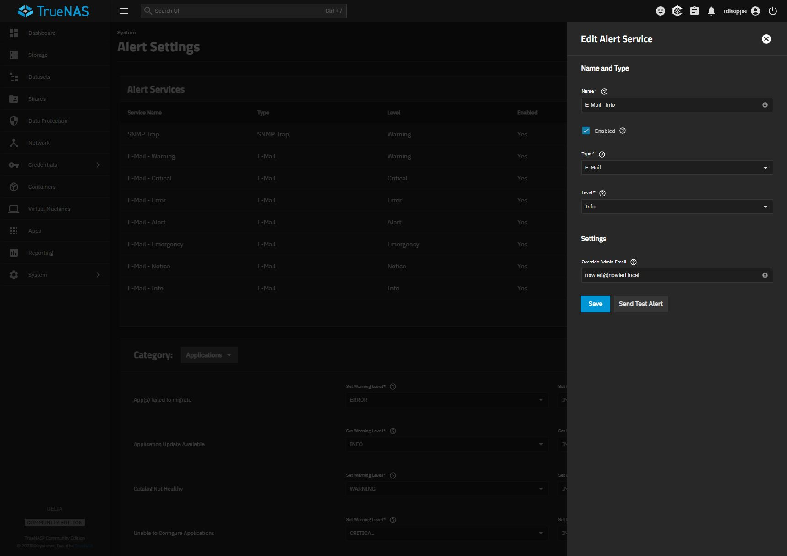
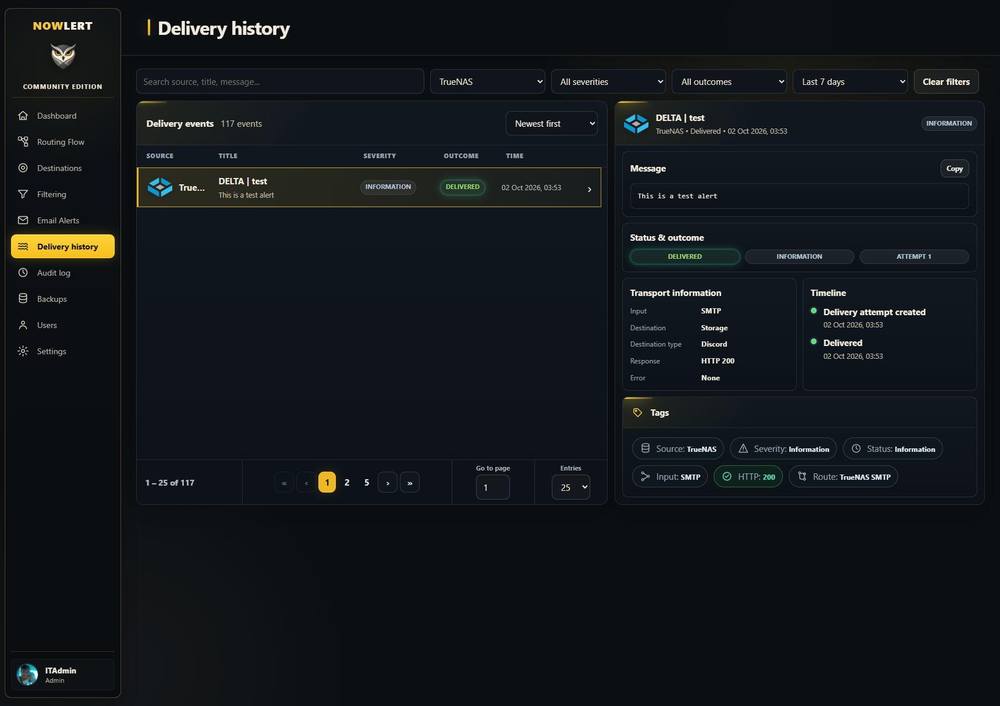

# TrueNAS alerts to Nowlert and Discord

Tested on **TrueNAS Community Edition 25.04.2.6**, 2 October 2026. Its native
**Send Test Alert** reached Nowlert as TrueNAS, followed **TrueNAS SMTP**, and was
delivered to the **Storage** Discord destination with **HTTP 200**.

## 1. Assign the route

In Nowlert **Destinations**, edit your Storage destination, select
**TrueNAS SMTP** under **Manage routes**, and save. No HTTP token is needed for
this SMTP flow. Keep the listener reachable only from intended senders using
the deployment's network controls.

## 2. Configure the global email transport

In TrueNAS **System → General Settings → Email → Configure**, select SMTP:

| Field | Tested local value | For your deployment |
|---|---|---|
| Outgoing Mail Server | `192.168.0.14` | Reachable Nowlert host address |
| Mail Server Port | `8025` | Published SMTP port, not the HTTP port |
| Security | Plain / No Encryption | Match the listener's actual capabilities |
| SMTP Authentication | Disabled | Match the listener's authentication model |
| From Email / Name | Existing TrueNAS sender retained | Your appliance's sender identity |

Save. The demonstrated private listener does not provide STARTTLS. Plain SMTP
was explicitly approved for this LAN; messages travel unencrypted. If encryption
is required, configure a suitable SMTP TLS relay and match its security mode.
Do not choose Auto/STARTTLS against a listener that cannot negotiate it.

The host address must be reachable from TrueNAS. `localhost` refers to TrueNAS,
not a separate Docker host. In Portainer, confirm the stack publishes
`8025:8025`; HTTP `18080` is a different listener.

## 3. Enable broad Email alert coverage

Open **System → Alert Settings**. Add or edit an **E-Mail** alert service:

- Enabled: yes.
- Level: **Info**, the lowest supported level.
- Override Admin Email: `nowlert@nowlert.local`, or your accepted alert recipient.
- Save the service.

Info includes higher alert levels too: Notice, Warning, Error, Critical, Alert,
and Emergency. Use Nowlert **Filtering** for destination-specific severity and
message policies. It does not export every TrueNAS audit event.

The demonstrated appliance already had seven Email services and one SNMP service.
Only its existing Info Email service's recipient was changed; the other services
were retained. Multiple enabled Email services can generate overlapping messages.
For a fresh deployment, one Info Email service is sufficient for this broad feed.

## 4. Test the real alert service

Select the configured Email service and use **Send Test Alert**. TrueNAS should
report **Test alert sent**. Global **Send Test Mail** checks transport separately
and can use a generic message layout; it is not a substitute for this alert test.

In Nowlert **Delivery history**, select the TrueNAS test and verify:

| Detail | Observed result |
|---|---|
| Event | `DELTA | test` / `This is a test alert` |
| Input | SMTP |
| Route | TrueNAS SMTP |
| Destination | Storage / Discord |
| Outcome | Delivered, attempt 1 |
| Response | HTTP 200, no error |

## Troubleshooting

- Timeout: check reachability and published SMTP port from the appliance.
- TLS negotiation failure: match Plain/STARTTLS/implicit TLS to the actual receiver.
- No alert email: check service Enabled, Info threshold, recipient, and saved transport.
- Generic classification: use the Email service's **Send Test Alert**, then inspect
  the source and route. Transport-only test messages can have different layouts.
- Duplicate notifications: inspect overlapping services and recipients before
  changing them. Preserve existing notification paths during migration.
- Received but suppressed: inspect Nowlert's centralized Filtering and Routing Flow.

The public [TrueNAS 25.04 alert-service API](https://api.truenas.com/v25.04.0/api_methods_alertservice.create.html)
documents service levels. UI labels differ across releases; this walkthrough
records the tested 25.04 screen rather than assuming all versions have the same UI.
