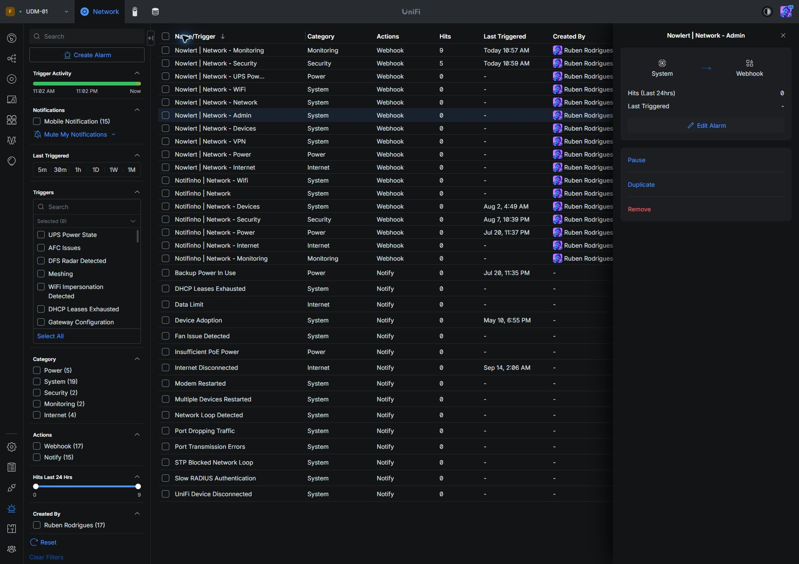
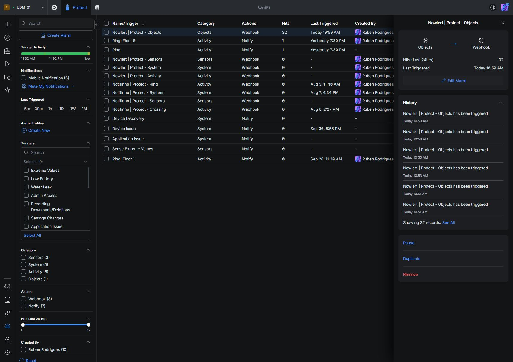
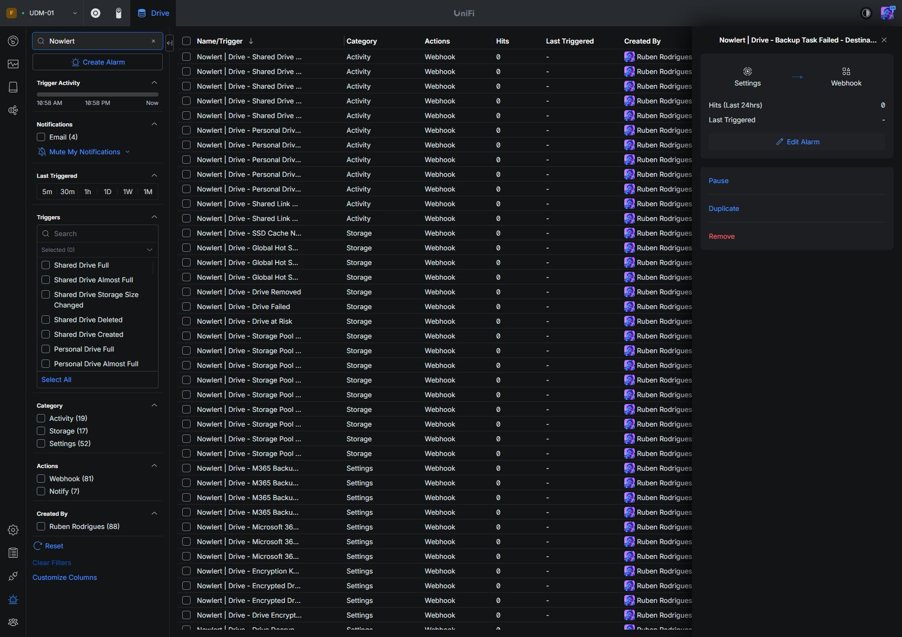
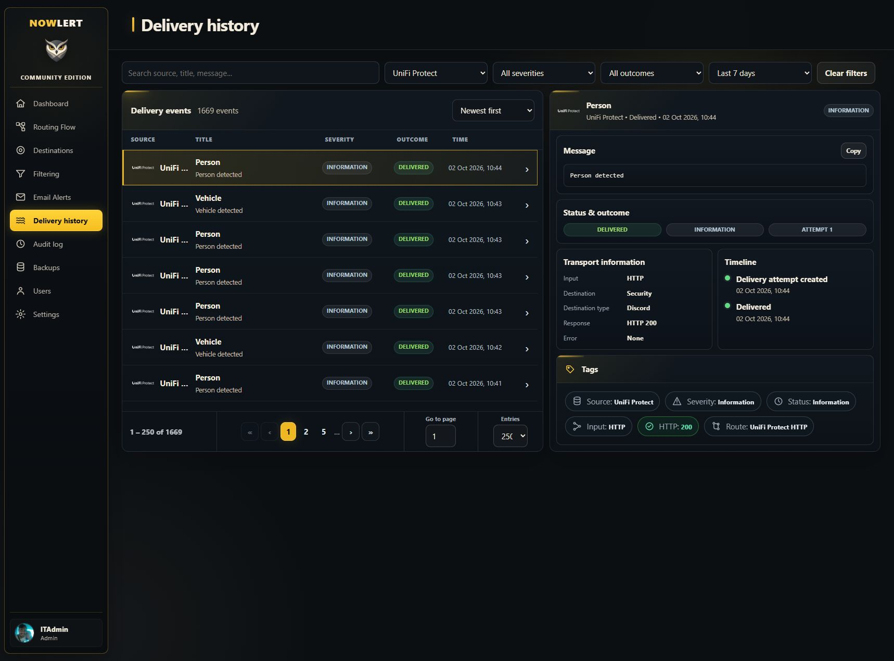
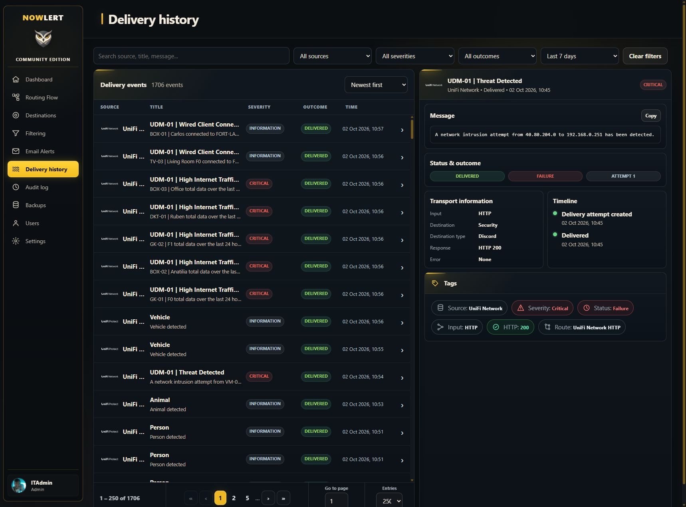
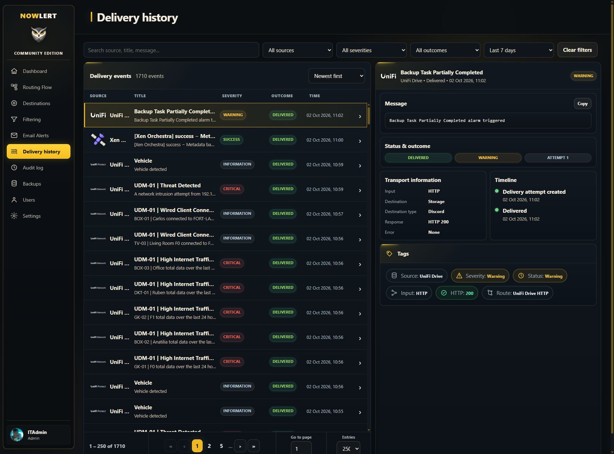
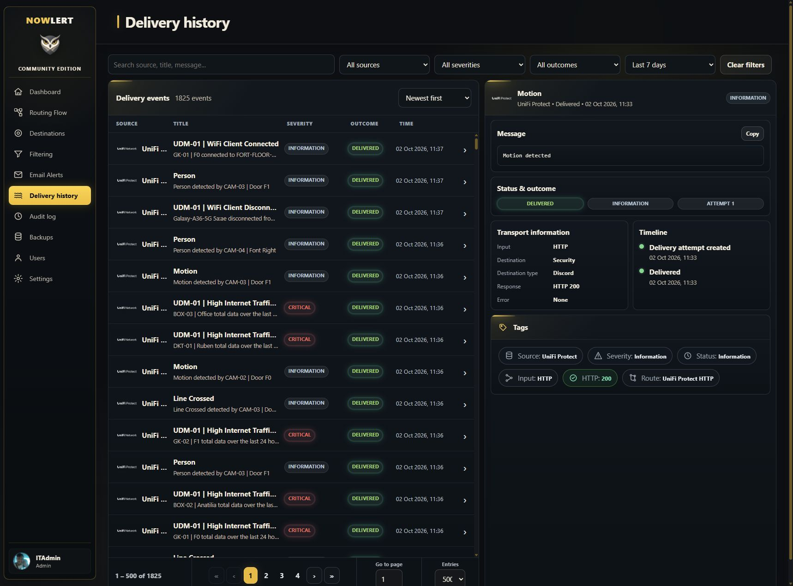
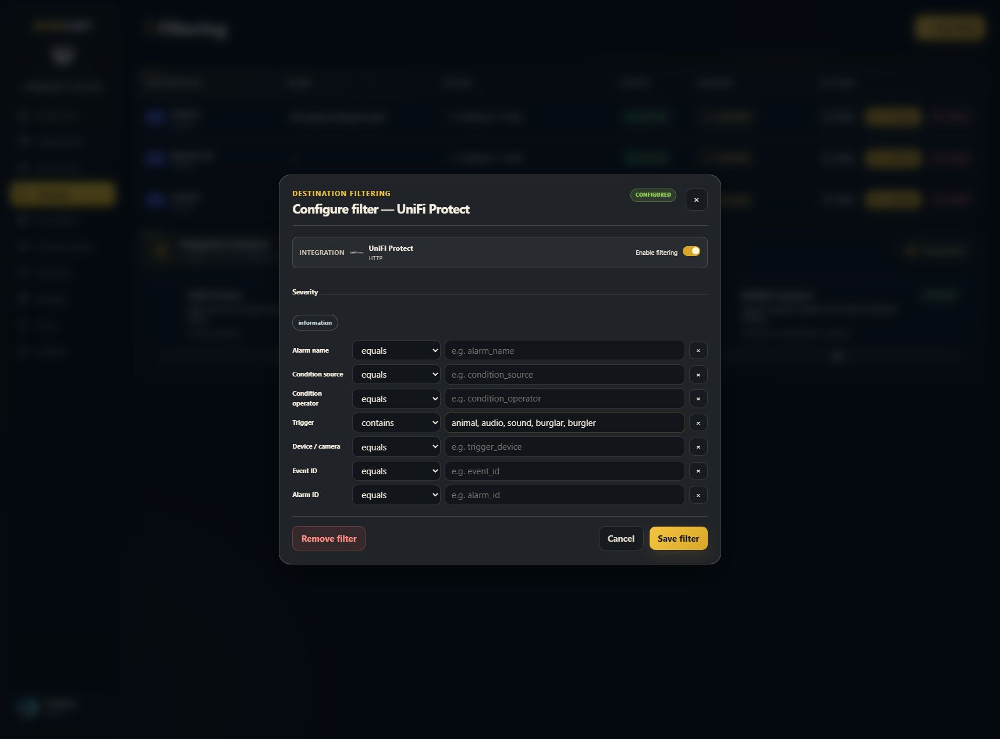

# UniFi Network, Protect and Drive to Discord

Configure UniFi Alarm Manager to send supported events to Nowlert, then use
Nowlert's destination filters to decide which alerts should reach Discord.
This walkthrough was captured on 2 October 2026 with Network 10.6.106,
Drive 4.4.9 and UniFi OS 5.1.33. Network and Protect run on UDM-01;
Drive runs on UNAS-01. Existing notification and webhook alarms were preserved.

## 1. Prepare routes and source tokens

In Nowlert, assign the built-in **UniFi Network HTTP**, **UniFi Protect HTTP**
and **UniFi Drive HTTP** routes to your destinations. Our Network and Protect
routes deliver to **Security**; Drive delivers to **Storage**.

Open your profile's **Security → API tokens → New token**. Issue one token per
application and select only that application's integration. Our rate limits are
120 requests/minute for Network, 300 for Protect and 60 for Drive. Adjust these
to the expected volume; a rate limit is not a notification filter. Tokens allow
event submission, not administrator access. Copy each value when issued; it is
shown once. Do not include tokens in screenshots, Git commits or URLs.

## 2. Use an authenticated HTTPS webhook

In the application's **Alarm Manager**, select **Create Alarm**, choose its
event triggers, and configure the action:

| Setting | Value |
|---|---|
| Action | Webhook |
| Webhook type | Custom Webhook |
| Delivery method | POST |
| Delivery URL: Network | `https://YOUR-NOWLERT-HOST/unifi/network` |
| Delivery URL: Protect | `https://YOUR-NOWLERT-HOST/unifi/protect` |
| Delivery URL: Drive | `https://YOUR-NOWLERT-HOST/unifi/drive` |
| Add Header: name | `X-Nowlert-Token` |
| Add Header: value | The token restricted to this application |
| Content | Default Content |
| Run This Action | Always |
| Ignore Repeated Alarms | Unchecked |

The Authentication dropdown can remain **None** because the custom header
provides authentication. This does not make the receiver anonymous. Leave
the Notify action off for these new forwarding alarms unless you also want
UniFi's own email/mobile notifications.

Use a hostname and certificate that the console can resolve and trust. In this
deployment the direct HTTP listener redirected requests to the HTTPS site;
the saved webhooks use the HTTPS destination directly. Do not assume a
published container port accepts plain HTTP without checking its configuration.

## 3. Network: cover every available event category

Create separate alarms for Monitoring, Internet, Power and Security, and for
System's VPN, Devices, Admin, Network and WiFi groups. Select all event types
in each group and include all applicable UniFi/client devices. We also added a
separate **UPS Power Restored** alarm because UPS Power State offers mutually
exclusive On Battery and Power Restored choices.

Monitoring includes client connection/disconnection, port anomalies and high
traffic. Continuous monitoring is enabled for disconnections. High traffic uses
the displayed default threshold of 10 GB over 24 hours; this is an alarm
threshold, not raw traffic telemetry. Other categories cover intrusion/firewall
events, power faults, VPN changes, device lifecycle, configuration changes,
network faults and WiFi issues.



## 4. Protect: select triggers and eligible devices

We created four forwarding alarms:

| Alarm | Enabled coverage |
|---|---|
| Objects | Person, Vehicle, Package, Animal; all eligible cameras and zones |
| Activity | Line Crossing, Person/Vehicle Idle Time, Ring, every available Sound class, Camera Motion |
| System | Device issues, adoption/removal, discovery, admin access, recording downloads/deletions, application issues, device limits, updates and settings changes |
| Sensors | Low Battery, Extreme Values in both directions, Water Leak; both eligible environmental sensors |

Expand each **Choose** control and select all eligible devices/zones/lines.
Selecting a trigger alone does not assign its devices. Package detection,
microphone events, motion, line crossing and environmental sensor types have
separate selectors. Save only after all required scopes are selected.

Disabled AI/ID/camera-input and unavailable hardware options were not enabled.
Light motion, motion-sensor and button triggers were not included in this
deployment's forwarding alarm. The Schedule trigger is a timer, not a source
event subscription. This setup forwards available alarm events, not video or
every raw telemetry sample; thumbnails were left off.



## 5. Drive: one alarm per event

Create a separate forwarding alarm for every event exposed by the current
Drive application. Name it **Nowlert | Drive - EVENT NAME** and select exactly
that event. Our console exposes 13 Activity, 16 Storage and 49 Settings event
types: 78 alarms in total. The [coverage manifest](../images/unifi-setup/event-coverage.json)
lists them individually.

Drive's default webhook may contain only an alarm ID and a message identifying
the alarm. A combined alarm cannot reliably identify which of its several
triggers fired. One descriptive alarm per event preserves a useful normalized
event name for Nowlert's central filters.

The categories include access failures, personal/shared-drive lifecycle and
capacity, pool/drive faults, backup failures and partial completion, snapshots,
SMB/NFS changes, encryption and Microsoft 365 backup outcomes. The event
catalog varies with Drive versions and supported features; do not claim an
event is subscribed if the console does not expose it.



## 6. Validate intake and destination delivery

Protect provides **Test Alarm**, but a test should follow complete device
selection. Also verify actual source events: this deployment received native
Person, Vehicle and Animal detections. In Nowlert's **Delivery history**, select
the event and confirm its source, route, destination, **Delivered** outcome and
HTTP 200 destination response.



Network emitted native intrusion and client-connection/high-traffic alarms.
The Threat Detected example below reached Security through UniFi Network HTTP.
Its **Failure** source status describes the reported condition; **Delivered**
and HTTP 200 describe the successful notification delivery.



Drive's alarm editor did not expose a Test Alarm control. We separately posted
a representative default Drive payload using its restricted token: the receiver
returned HTTP 204 and the notification reached Storage with HTTP 200. This
validates parsing, authentication, route assignment and destination delivery.
It is **not evidence that UNAS emitted a native callback**. Native Drive
delivery remains to be checked when a configured event occurs. Do not provoke
a storage fault or change production backup jobs merely to force a test.



## 7. Filter centrally

### Match the camera names in Protect

Open Protect's **Devices** page and copy each camera's exact name and MAC
address. In Nowlert, open **Filtering → Integration behavior → UniFi Protect →
Edit**. Enter one `MAC = Alias` line per device and save settings. For example:

```text
AC:8B:A9:0D:D8:AD = CAM-01 | Hall Out
```

Use the names shown in your console, including any punctuation. This deployment
saved all eight camera/doorbell names and the console, gateway and two sensor
names. New events confirmed names such as `CAM-03 | Door F1`; old delivery
records retain the names captured when they were received. These are saved
aliases, not an automatic synchronization with future Protect name changes.



### Suppress animal and audio/burglar notifications

For the destination receiving Protect events, select **Configure → UniFi
Protect → Configure**, enable filtering, and set the **Trigger** field to
**contains** with these comma-separated values:

```text
animal, audio, sound, burglar, burgler
```

Leave unrelated fields empty and save the filter. The destination editor saves
a **block** policy: matching any of these trigger values suppresses that
destination's notification. Other triggers remain allowed. This example
suppresses all matching audio/sound triggers, not only burglar detections;
choose narrower values if you want to retain other audio alert classes.
Keep existing filters for other integrations intact.

Animal and `alrmBurglar` receiver test events returned HTTP 204 and each appeared
in Routing Flow as **filtered**, with **0** delivery attempts. This proves the
destination filter path; these two verification events were synthetic, not
camera detections. Upstream Protect alarms remain enabled, so Nowlert still
receives the events.



### Review further noise before blocking it

Keep source forwarding broad. In Nowlert **Filtering**, configure each
destination's policy using integration, event type, severity and device fields.
Verify a matching unwanted event is filtered while a relevant event still
delivers. Rate limits, camera detection zones and UniFi alarm thresholds are
upstream constraints; central filters cannot recover events that UniFi never
emitted. Review event coverage again after a UniFi upgrade or hardware change.

## Troubleshooting

- **No intake:** check console DNS, TLS trust and the saved HTTPS URL. A browser
  opening the site does not establish console connectivity.
- **401/403:** verify the header spelling and token source scope.
- **429:** inspect the source token's rate limit and expected event volume.
- **Cannot save Protect alarm:** expand each device selector; every selected
  trigger needs eligible devices, zones or lines.
- **Drive messages lack event detail:** use one event per descriptively named
  alarm and keep Default Content.
- **Intake but no delivery:** inspect route assignment and destination filters.
- **Repeated notifications:** leave upstream event collection intact and add
  the required destination filter or deduplication policy centrally.

See [Ubiquiti's Alarm Manager documentation](https://help.ui.com/hc/en-us/articles/27721287753239-UniFi-Alarm-Manager-Customize-Alerts-Integrations-and-Automations-Across-UniFi)
and [Protect webhook documentation](https://help.ui.com/hc/en-us/articles/25478744592023-Send-UniFi-Protect-Alerts-to-Web-Services-using-Webhooks).
