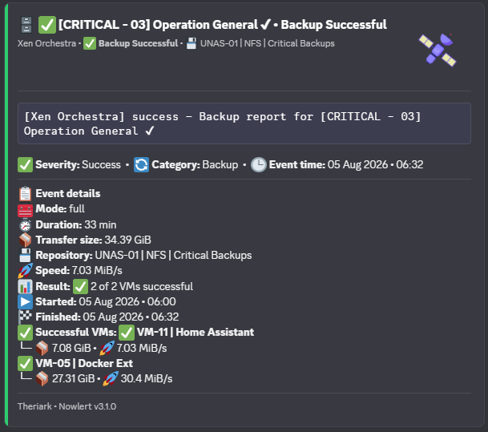

# Route Xen Orchestra alerts through Nowlert CE to Discord

Xen Orchestra can already send infrastructure notifications by SMTP. Nowlert CE
sits directly in that path: Xen Orchestra sends the message to Nowlert's SMTP
listener, Nowlert detects and normalises the Xen Orchestra event, a deterministic
route selects the destination, and Discord receives a compact source-aware card.

```text
Xen Orchestra
    |
    | SMTP
    v
Nowlert CE
    |
    | detect + normalise `xo`
    | deterministic route
    v
Discord
```

This is useful when long infrastructure emails contain the information you need
but are difficult to scan quickly during normal operations.

## What you need

- a running Nowlert CE v3.1.2 instance;
- network reachability from Xen Orchestra to Nowlert's SMTP listener;
- a Discord webhook for the channel that should receive the notification; and
- a Nowlert user with permission to create the destination and route.

The default SMTP listener is configured in `config.yaml`:

```yaml
smtp:
  enabled: true
  host: 0.0.0.0
  port: 8025
```

Do not recreate destinations or routes in YAML on a current installation. Those
resources are managed through the WebUI and stored in the platform database.

## 1. Create the Discord destination

In the Nowlert WebUI:

1. Open **Destinations**.
2. Create a new **Discord** destination.
3. Give it a clear name, for example `Infrastructure Discord`.
4. Enter the Discord webhook secret when prompted.
5. Save the destination.

Nowlert treats destination credentials as write-only secrets. Normal read views
do not expose the stored webhook URL again.

## 2. Create a Xen Orchestra SMTP route

Open **Routes** and create a route with:

- **Integration:** Xen Orchestra
- **Input:** SMTP
- **Destination:** the Discord destination created above
- **Enabled:** yes

For the first validation, keep host/event/severity/status filtering simple so a
normal Xen Orchestra notification can match. Once delivery is confirmed, add
filters for the hosts or event families that should reach this destination.

Dedicated integration routes are evaluated before wildcard fallback routes, so
a matching Xen Orchestra route does not also fan out through a generic fallback
unless no dedicated route matches.

## 3. Point Xen Orchestra at Nowlert SMTP

Configure the Xen Orchestra notification/email target to use the hostname or IP
address of your Nowlert instance and the configured SMTP port (8025 by default).

On a trusted private network, the backward-compatible listener can run without
SMTP authentication. For untrusted networks, enable STARTTLS first and then SMTP
AUTH if the sender supports it. Nowlert does not allow SMTP AUTH before TLS.

Use network/firewall rules to restrict the SMTP port to intended infrastructure
senders.

## 4. Send a safe real event

Use a normal Xen Orchestra backup/task notification rather than manufacturing a
failure. The objective is to validate the real path:

```text
Xen Orchestra
  -> SMTP listener
  -> Xen Orchestra parser
  -> normalised event
  -> Xen Orchestra (SMTP) route
  -> Discord adapter
  -> Discord
```

A successful test proves the actual parser, route and destination path rather
than only a synthetic preview.

## 5. Verify the result

Check three places:

1. **Discord** — confirm the Xen Orchestra card is readable and contains the
   expected task/backup information.
2. **Delivery History** — confirm the event was delivered through the intended
   route and destination.
3. **Routes** — confirm the dedicated Xen Orchestra route, not a generic
   fallback, was responsible for delivery.

The current public visual baseline includes an approved Xen Orchestra Discord
example:



## Optional: harden SMTP transport

If Xen Orchestra supports STARTTLS, configure a certificate and private key in
Nowlert and enable TLS. SMTP AUTH can then be enabled with a single service
account whose password is supplied by an environment variable or mounted secret.

See [SMTP security](../smtp-security.md) for the complete rollout and rollback
procedure.

## Why use Nowlert instead of mailbox rules?

Mailbox forwarding still leaves the original vendor-specific message as the
operational interface. Nowlert instead gives the event a deterministic
infrastructure path:

- direct SMTP ingestion;
- source detection and normalisation;
- database-backed routing;
- destination-aware presentation;
- delivery history and auditability; and
- no dependency on Microsoft Graph, Gmail, IMAP or mailbox polling.

## Run Nowlert CE

Nowlert CE is free, open source and self-hosted.

- Repository: https://github.com/Theriark/nowlert-ce
- Quick start: https://github.com/Theriark/nowlert-ce#-quick-start
