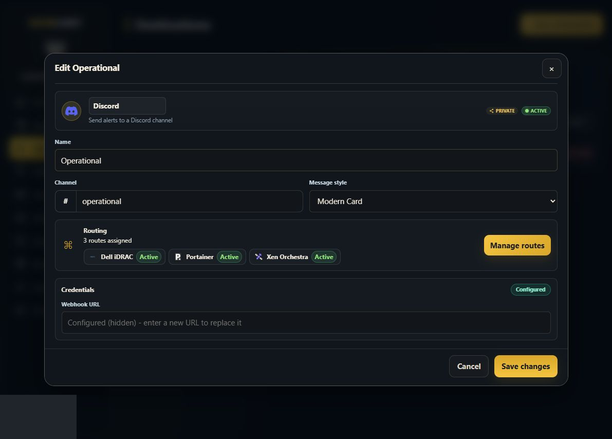
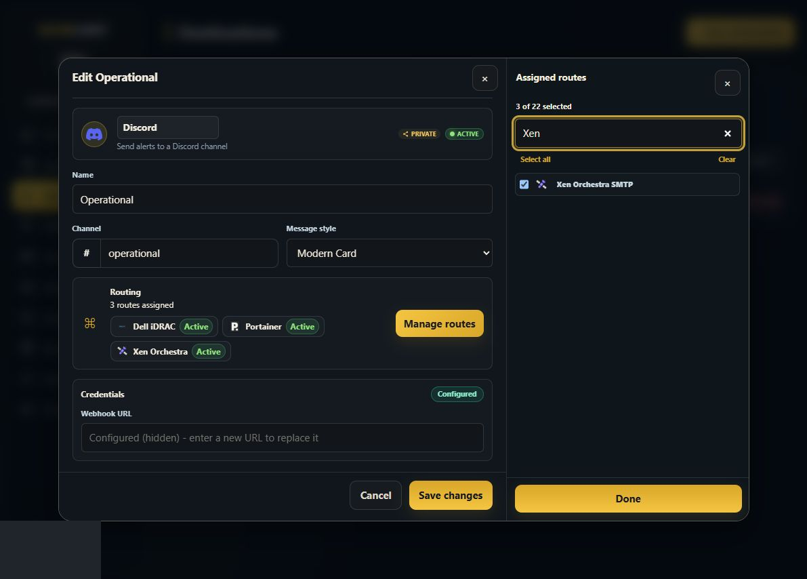
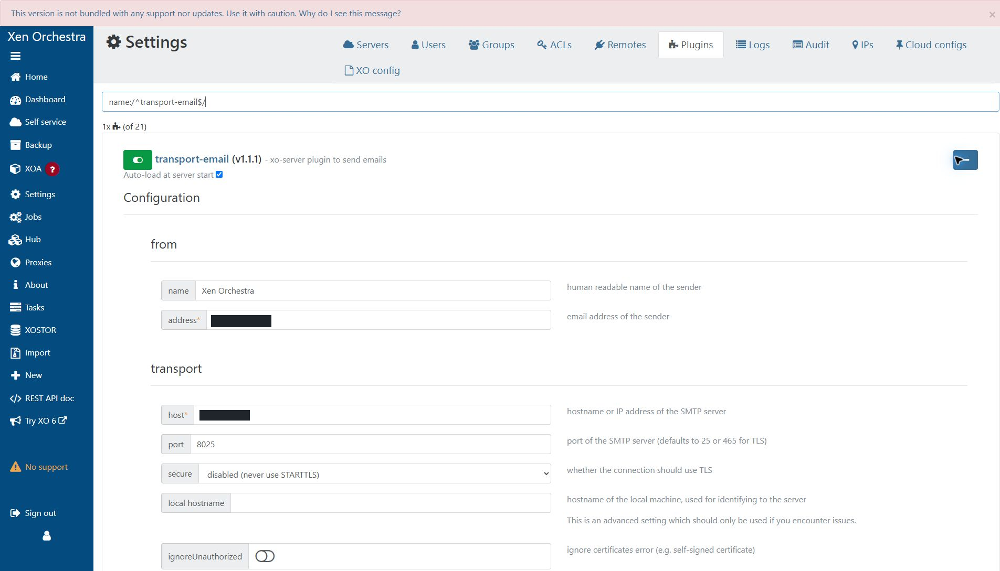
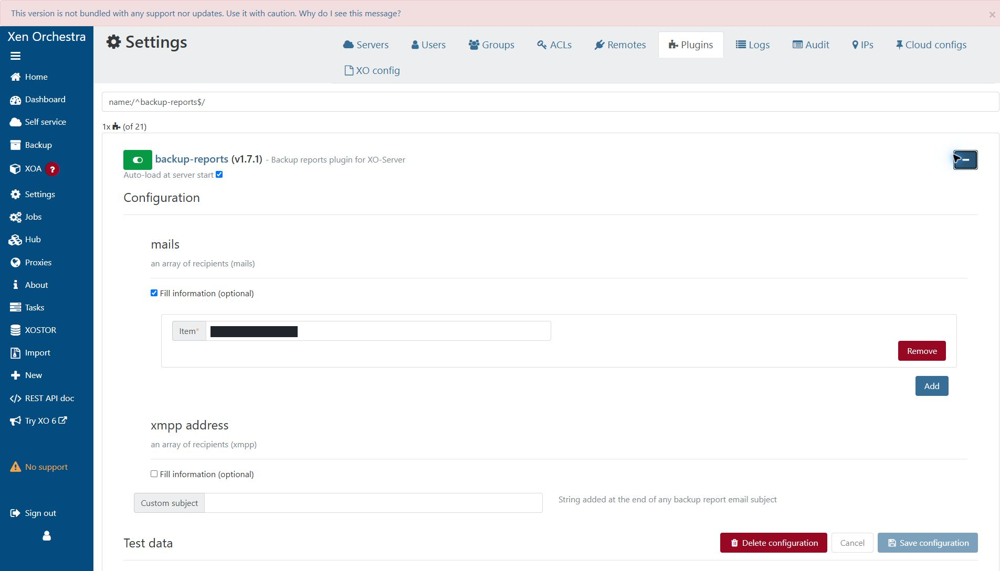
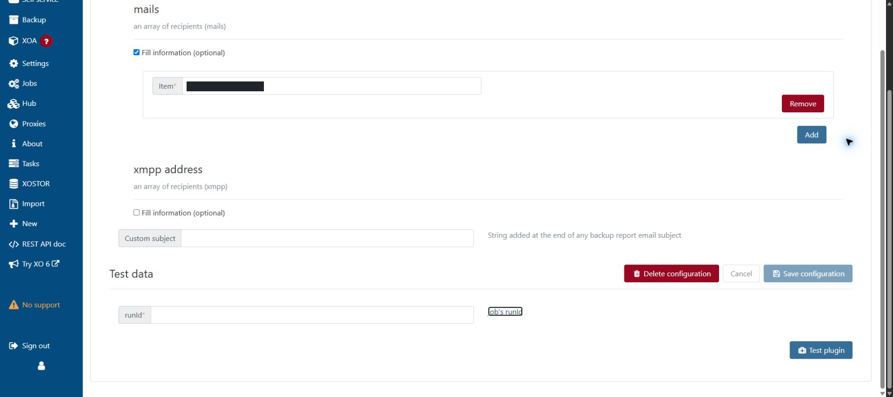
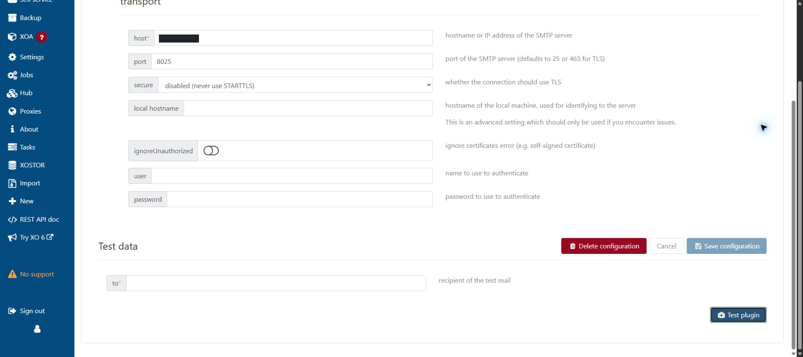
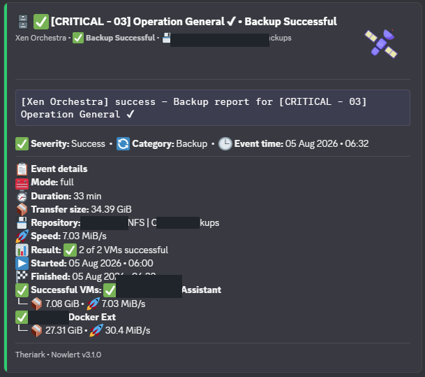
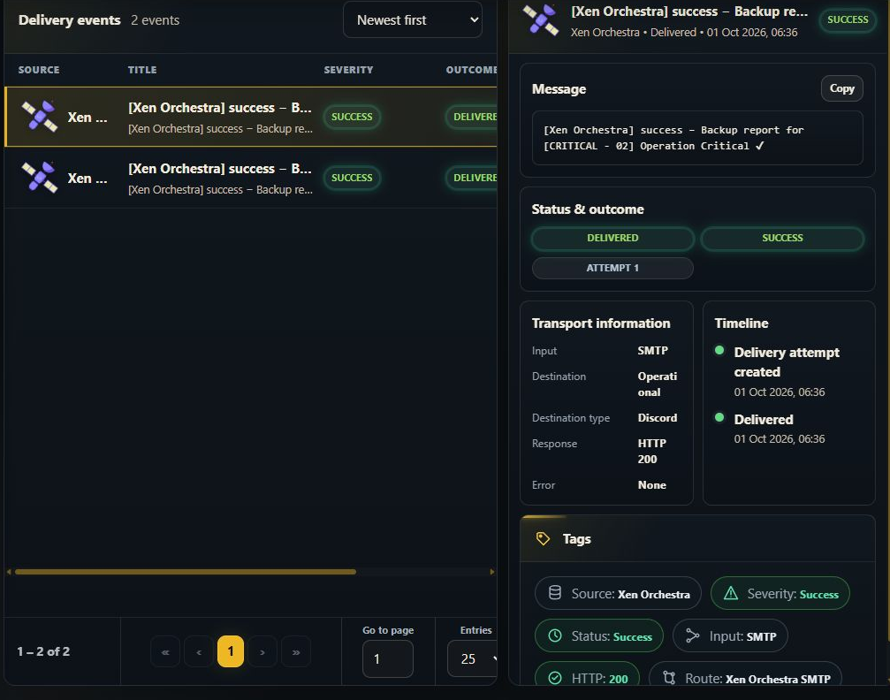

# Route Xen Orchestra alerts through Nowlert CE to Discord

Xen Orchestra can already send infrastructure notifications by SMTP. Nowlert CE
sits directly in that path: Xen Orchestra sends the message to Nowlert's SMTP
listener, Nowlert detects and normalises the Xen Orchestra event, a deterministic
route selects the destination, and Discord receives a compact source-aware card.

```text
Xen Orchestra
    |
    | SMTP
    v
Nowlert CE
    |
    | detect + normalise `xo`
    | deterministic route
    v
Discord
```

This is useful when long infrastructure emails contain the information you need
but are difficult to scan quickly during normal operations.

## What you need

- a running current Nowlert CE instance;
- network reachability from Xen Orchestra to Nowlert's SMTP listener;
- a Discord webhook for the channel that should receive the notification; and
- a Nowlert user with permission to create the destination and assign routes.

The default SMTP listener is configured in `config.yaml`:

```yaml
smtp:
  enabled: true
  host: 0.0.0.0
  port: 8025
```

Do not recreate destinations or routes in YAML on a current installation. Those
resources are managed through the WebUI and stored in the platform database.

## 1. Create the Discord destination

In the Nowlert WebUI:

1. Open **Destinations**.
2. Create a new **Discord** destination.
3. Give it a clear name, for example `Infrastructure Discord`.
4. Enter the Discord webhook secret when prompted.
5. Save the destination.

Nowlert treats destination credentials as write-only secrets. Normal read views
do not expose the stored webhook URL again.



## 2. Assign the Xen Orchestra SMTP route

Edit the destination, choose **Manage routes**, and select the built-in
**Xen Orchestra SMTP** route. Choose **Done**, then **Save changes**. On a current
fresh installation the integration routes are supplied by the image; assigning
one does not require creating it again. If it is already assigned, keep that
assignment.



For the first validation, keep host/event/severity/status filtering simple so a
normal Xen Orchestra notification can match. Once delivery is confirmed, add
filters for the hosts or event families that should reach this destination.

Dedicated integration routes are evaluated before wildcard fallback routes, so
a matching Xen Orchestra route does not also fan out through a generic fallback
unless no dedicated route matches.

## 3. Point Xen Orchestra at Nowlert SMTP

In Xen Orchestra, open **Settings → Plugins**. Configure and enable
**transport-email** first; **backup-reports** uses this transport to send its
report to the recipients configured separately.

| transport-email field | Value |
|---|---|
| From name | A recognizable sender, such as `Xen Orchestra` |
| From address | Your infrastructure sender address |
| Host | A hostname or IP reachable from the Xen Orchestra server |
| Port | The **published SMTP port**, 8025 in the tested deployment |
| Secure | Match what the Nowlert SMTP listener actually offers |
| User / password | Supply only when SMTP AUTH is enabled |

Save the configuration. In **backup-reports**, configure the recipient email
address and save. Use **Test plugin** with a valid backup run ID, then check
Nowlert and the destination channel. See
[Xen Orchestra's backup-report documentation](https://docs.xen-orchestra.com/backups-and-dr/backup_reports).









The illustrated private deployment uses `alerts@example.com` as the recipient
label. Xen Orchestra delivers it to the configured SMTP host; this flow does not
require provisioning an external mailbox with that address. Use your own label.
To make delivery policy central, set each supported backup job's **Report**
condition to **Always**. **Skipped and failure**, **Failure**, and **Never**
suppress reports at the source. Changing the plugin alone does not change a
job's reporting policy. In the 2 October audit, all six backup jobs were
verified as Always, including configuration/metadata; two had previously
suppressed successful reports. See the
[coverage audit](centralized-event-coverage.md) for scope and remaining limits.

The tested private deployment used an unauthenticated SMTP listener without
STARTTLS, so **secure: disabled (never use STARTTLS)** matched that listener.
This is not a universal TLS setting: if your listener advertises STARTTLS,
configure Xen Orchestra accordingly. An HTTP UI port, such as 18080, is not
the SMTP receiver port.

For a connection timeout, check from the **Xen Orchestra server** that the
chosen host and port reach the SMTP listener. A TCP connection should receive
an SMTP `220` greeting. Check container port publishing, interface binding,
firewall rules, and routing before changing TLS settings repeatedly.

On a trusted private network, the backward-compatible listener can run without
SMTP authentication. For untrusted networks, enable STARTTLS first and then SMTP
AUTH if the sender supports it. Nowlert does not allow SMTP AUTH before TLS.

Use network/firewall rules to restrict the SMTP port to intended infrastructure
senders.

## 4. Send a safe real event

Use a normal Xen Orchestra backup/task notification rather than manufacturing a
failure. The objective is to validate the real path:

```text
Xen Orchestra
  -> SMTP listener
  -> Xen Orchestra parser
  -> normalised event
  -> Xen Orchestra (SMTP) route
  -> Discord adapter
  -> Discord
```

A successful test proves the actual parser, route and destination path rather
than only a synthetic preview.

## 5. Verify the result

Check three places:

1. **Discord** — confirm the Xen Orchestra card is readable and contains the
   expected task/backup information.
2. **Delivery History** — confirm the event was delivered through the intended
   route and destination.
3. **Destination → Manage routes** — confirm the dedicated Xen Orchestra route
   is assigned. Use the delivery details to establish which route matched.

The current public visual baseline includes an approved Xen Orchestra Discord
example:



The following real deployment capture shows a successfully delivered backup
report: SMTP input, the Operational Discord destination, HTTP 200, and no error.
This verifies an actual report, beyond the plugin's success indication.



The configuration captures above were taken from the saved plugin forms on
2 October 2026; no configuration was changed to take them. Their SMTP password
field is empty, and browser session URLs are excluded. The delivery screenshot
shows the previously received real backup report, rather than claiming a new
test was sent during documentation capture.

## Troubleshooting

| Symptom | Check |
|---|---|
| `Connection timeout` after a long spinner | From the XO server, verify TCP reachability to the Docker host's published SMTP port and an SMTP `220` greeting. Do not use the WebUI port. |
| TLS negotiation error | Match the XO security setting to the SMTP listener's actual TLS configuration. The screenshots show a private listener without STARTTLS. |
| Test rejects `runId` | Choose an existing backup execution's run ID; it is not the job name or an arbitrary timestamp. |
| Test succeeds but no scheduled reports | Check the backup job's Report condition, plugin enablement, and Auto-load at server start. |
| Nowlert receives the report but Discord does not | Check the Xen Orchestra SMTP assignment, destination enablement, filters, and Delivery history error. |

## Optional: harden SMTP transport

If Xen Orchestra supports STARTTLS, configure a certificate and private key in
Nowlert and enable TLS. SMTP AUTH can then be enabled with a single service
account whose password is supplied by an environment variable or mounted secret.

See [SMTP security](../smtp-security.md) for the complete rollout and rollback
procedure.

## Why use Nowlert instead of mailbox rules?

Mailbox forwarding still leaves the original vendor-specific message as the
operational interface. Nowlert instead gives the event a deterministic
infrastructure path:

- direct SMTP ingestion;
- source detection and normalisation;
- database-backed routing;
- destination-aware presentation;
- delivery history and auditability; and
- no dependency on Microsoft Graph, Gmail, IMAP or mailbox polling.

## Run Nowlert CE

Nowlert CE is free, open source and self-hosted.

- Repository: https://github.com/Theriark/nowlert-ce
- Quick start: https://github.com/Theriark/nowlert-ce#-quick-start
