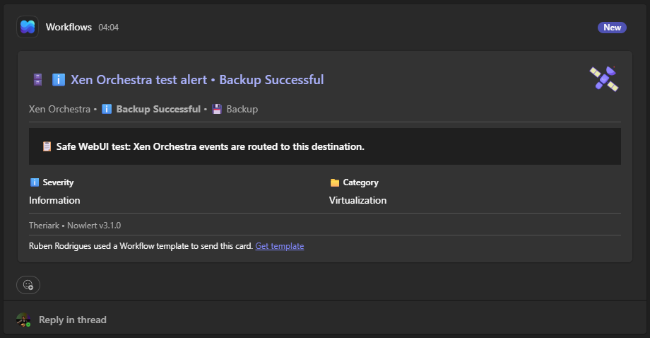

# Send Xen Orchestra alerts to Microsoft Teams with Nowlert CE

Xen Orchestra can send infrastructure and backup notifications by SMTP. Nowlert
CE receives those messages directly, identifies the Xen Orchestra source,
normalises the useful fields, applies a deterministic route, and renders a
Microsoft Teams Adaptive Card.

```text
Xen Orchestra
    |
    | SMTP
    v
Nowlert CE
    |
    | Xen Orchestra (SMTP) route
    v
Microsoft Teams
```

This guide targets the current Nowlert CE platform model: destinations and
routes are created in the WebUI and stored in the platform database. Do not add
legacy `outputs:` or `routing:` sections to `config.yaml`.

## 1. Confirm the SMTP listener

The default listener is:

```yaml
smtp:
  enabled: true
  host: 0.0.0.0
  port: 8025
```

Publish the port only to the networks or source addresses that need to send
mail. If the path is not fully trusted, enable STARTTLS and optionally SMTP AUTH
as described in [SMTP security](../smtp-security.md).

## 2. Point Xen Orchestra at Nowlert

In Xen Orchestra, configure the SMTP transport used for normal notification
mail:

- SMTP server: the hostname or address of the Nowlert host;
- port: the published Nowlert SMTP port;
- encryption/authentication: match the Nowlert SMTP security configuration;
- recipient: use the address expected by the Xen Orchestra notification
  configuration. Nowlert receives the SMTP message directly; it does not poll a
  mailbox.

Use a routine backup/task notification for the first test rather than creating
an artificial failure.

## 3. Create the Microsoft Teams destination

In **Destinations** in the Nowlert WebUI:

1. create a destination;
2. choose **Microsoft Teams**;
3. give it a clear name such as `Infrastructure - Teams`;
4. enter the Teams webhook/workflow URL in the write-only secret field;
5. save it; and
6. use the destination test action before attaching production routes.

The credential is not returned by normal read APIs after it is stored.

## 4. Create the Xen Orchestra route

In **Routes**, create a route with:

- Integration: **Xen Orchestra**;
- Input: **SMTP**;
- Destination: the Teams destination created above;
- Enabled: yes.

Optional host/event/severity/status filters can narrow the route. If Xen
Orchestra has a dedicated matching route, a wildcard fallback route is not used
as an additional fan-out path.

## 5. Send a real safe notification

Run or wait for an ordinary Xen Orchestra backup/task that already produces an
email notification.

The expected path is:

```text
Xen Orchestra SMTP message
  -> SMTP input
  -> Xen Orchestra detection/parser
  -> normalised event
  -> Xen Orchestra (SMTP) route
  -> Teams destination
  -> Adaptive Card
```

## 6. Verify the result

Check **Delivery History** in Nowlert and confirm:

- source/integration is Xen Orchestra;
- the expected route and Teams destination were selected;
- the delivery outcome is successful; and
- no fallback route produced a duplicate delivery.

Then compare the delivered Teams card with the original Xen Orchestra message.
The useful operational fields should be visible without having to scan the full
raw email.

Current presentation example:



## Why use Nowlert in the middle?

The value is not just forwarding mail. Nowlert gives the notification a shared,
source-aware path:

- Xen Orchestra is detected as an integration rather than treated as arbitrary
  mail;
- vendor-specific content is normalised before routing;
- destination selection is deterministic and auditable;
- Teams receives destination-aware presentation; and
- the same operational model can also serve Discord, Slack, generic webhooks,
  MQTT, and ntfy.

## Troubleshooting

### Xen Orchestra cannot connect to SMTP

Confirm the published port, firewall rules, STARTTLS requirements and SMTP AUTH
settings. If TLS is enabled, make sure Xen Orchestra trusts the certificate.

### Mail arrives but Teams does not

Check the Xen Orchestra route, route filters, destination enabled state and
Delivery History. Test the Teams destination independently to separate routing
problems from destination credential/network problems.

### Duplicate notifications

Check for multiple dedicated Xen Orchestra routes that target the same or
different destinations. Wildcard routes are fallback-only and should not add a
second delivery when a dedicated Xen Orchestra route matched.

## Next step

Run Nowlert CE from the public repository and use the same model for the other
infrastructure systems that already report by SMTP, HTTP or Redfish:

- <https://github.com/Theriark/nowlert-ce>
