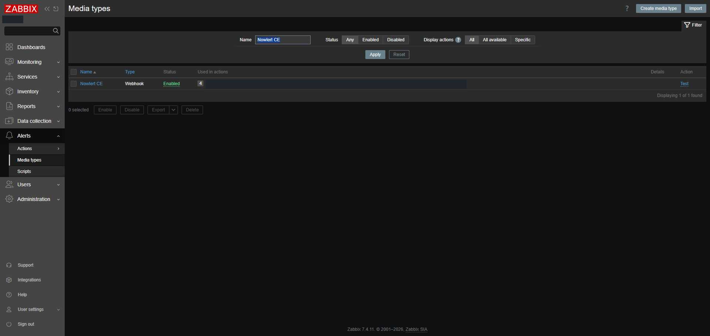
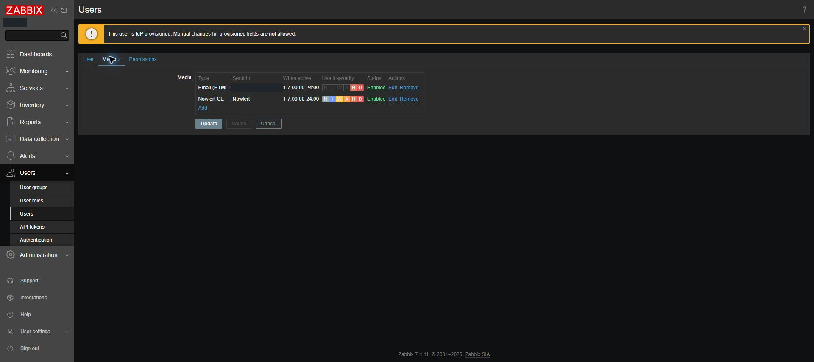
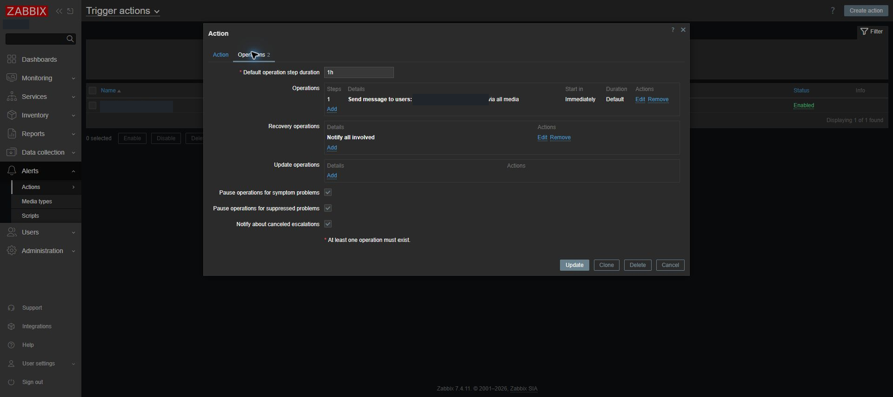
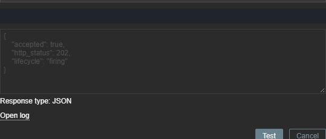
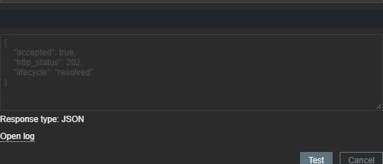

# Zabbix native webhooks to Nowlert CE

Configure Zabbix's notification media to send problems and recoveries to Nowlert,
then apply delivery filters centrally. This walkthrough was tested on **Zabbix
7.4.11** on 2 October 2026, using Nowlert development image
`sha-abdc92887fc508bf1f105697eb48772acda78b08`.

## 1. Prepare Nowlert

1. Create or edit your destination in **Destinations** and test it.
2. Open **Manage routes**, select the built-in **Zabbix HTTP** route, click
   **Done**, then **Save changes**. Do not create duplicate routes.
3. Open your user menu → **Profile → API tokens**, then issue an application token scoped only to
   `zabbix`. Choose a rate limit suited to your alert volume; this deployment
   uses 300 events/minute. Copy the value privately when issued.

The Zabbix server must reach your Nowlert HTTPS address. A private address works
when both servers can reach the same LAN; it does not require a public callback.
The recipient used in this deployment is the existing **Criticals** destination.

## 2. Import the webhook

Download [the Zabbix 7.4 media template](../examples/zabbix/nowlert-media-7.4.json).
In Zabbix, open **Alerts → Media types → Import**, select that JSON file, and
import it. It creates the **Nowlert CE** Webhook media type and message templates.

Open the new media type and replace these two parameter values:

| Parameter | Value |
|---|---|
| `url` | Your Nowlert HTTPS origin, for example `https://nowlert.example.com` |
| `token` | Your Zabbix-scoped application token |

Keep the other parameters as Zabbix macros. Save with the media type enabled.
The webhook adds the bearer token to the Authorization header and posts the
`nowlert.event.v1` envelope to `/api/v2/events`. It has a 15-second timeout and
three attempts, 30 seconds apart. Tokens are never included in the event body.
Do not publish a configured export: its media parameters contain the token.

## 3. Enable recipient media

Open **Users → Users → your notification recipient → Media → Add**:

- Type: **Nowlert CE**.
- Send to: `Nowlert`. This is a required Zabbix recipient label; the actual
  callback address comes from the media type's `url` parameter.
- When active: `1-7,00:00-24:00`.
- Use if severity: select all six severities.
- Enabled: checked.

Click **Add**, then **Update** on the user form. Reopen it to confirm persistence.
An IdP-managed profile may require editing through the administrator's Users page.
Existing email media can remain enabled.

## 4. Check the notification action

Open **Alerts → Actions → Trigger actions**. Use one action that sends to your
recipient through **Nowlert CE** or **all media**, with conditions covering the
hosts/events you intend to forward. Add a recovery operation such as **Notify
all involved**. Avoid a second overlapping action, which duplicates delivery.

In the tested deployment, the existing enabled action **Report problems to
the configured recipient** has no narrowing conditions, sends problems via all media, and notifies
all involved on recovery. Its existing suppression/symptom pause settings were
retained. It has no update operation: acknowledgements and comments are not
forwarded unless an update operation is added. Internal-event actions are
separate from trigger actions; inspect their conditions and recipients too.

## 5. Test from Zabbix

In **Alerts → Media types**, click **Test** for Nowlert CE. Replace unresolved
macros in the test form with controlled values:

| Parameter | Problem test | Recovery test |
|---|---|---|
| `subject` | `[SIMULATED CONDITION] Zabbix native webhook problem` | `[SIMULATED CONDITION] Zabbix native webhook recovery` |
| `message` | `Controlled notification test; no host fault introduced.` | `Controlled notification recovery; no host fault introduced.` |
| `host_name` | `SIMULATION-ZABBIX` | `SIMULATION-ZABBIX` |
| `event_id` | A unique test identifier | The same test identifier |
| `event_name` | `Nowlert native webhook test` | `Nowlert native webhook test` |
| `event_value` | `1` | `0` |
| `event_nseverity` | `4` | `4` |
| `event_source` | `0` | `0` |

Keep the configured URL/token private. Run each test. Both should show **Media
type test successful**, HTTP **202**, and lifecycle `firing` or `resolved`.
Then check **Nowlert → Delivery history** and the destination itself. Acceptance
by Nowlert alone does not prove delivery.

Both tests in this deployment reached Discord: problem displayed **Failure**,
recovery displayed **Successful**, with delivery HTTP **200** and no error code.
The [token-free delivery records](../examples/integration-validation-2026-10-02.json)
include both results. These are requests emitted by Zabbix's native media test
with simulated conditions. They verify its transport, parsing, routing and
Discord delivery; they do not prove a real trigger/action lifecycle. To verify
that last step, use a dedicated disposable test item/trigger and drive it through
problem and recovery without changing production device checks.

## Lifecycle and severity

The webhook maps event value `1` to `firing` and `0` to `resolved`. Zabbix
Not classified/Information map to Nowlert information, Warning/Average to warning,
and High/Disaster to critical. Recovery status drives the successful notification
presentation even when the original problem severity is retained. A media test
must use literal values because Zabbix does not resolve event macros there.

## Troubleshooting

- **401/403:** check the token, expiry/revocation, enabled owner, and `zabbix` scope.
- **400:** check required text and envelope fields; use literal test macro values.
- **Timeout/TLS error:** test connectivity from the Zabbix server, DNS and trusted
  certificates. Do not disable verification to conceal an invalid certificate.
- **202 but no destination message:** confirm the selected Zabbix HTTP route,
  destination enabled state, central filtering and Delivery history outcome.
- **Media test passes but real alerts do not:** check recipient media, active
  hours, severities, host permissions, action conditions, suppression and recovery
  operations. Review Zabbix **Reports → Action log** for failed sends.

## Retirement after recording validation

When ready to retire Zabbix, disable its Nowlert recipient media or dedicated
forwarding action, revoke the Zabbix-only Nowlert token, and remove private token
exports. Preserve the tutorial and delivery history. Decommissioning the Zabbix
server belongs to the infrastructure retirement workflow; this setup does not
stop or delete that server.

Reference: [Zabbix 7.4 Webhook media documentation](https://www.zabbix.com/documentation/7.4/en/manual/config/notifications/media/webhook).
