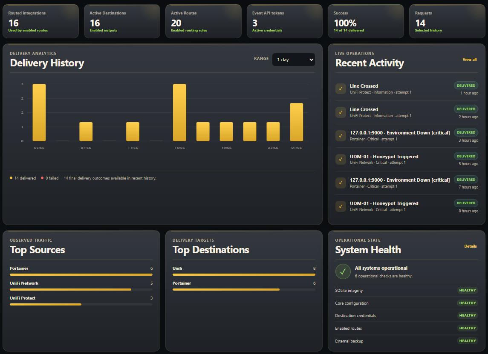
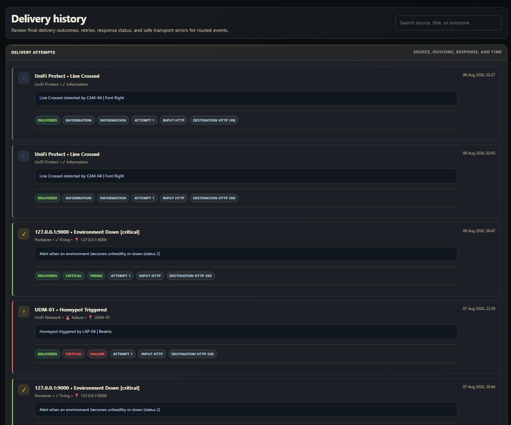

# WebUI

Current Nowlert packages a responsive, dependency-free management interface in
the application image. The browser uses the authenticated same-origin
`/api/v2` contract and never needs direct access to SQLite or secret files.

The current WebUI keeps the approved v3.1 visual language while evolving the management workflows. Existing approved
screenshots therefore remain the visual baseline where a screenshot is useful;
new screenshots are required only when the rendered UI materially changes.

## Activation

```yaml
http:
  enabled: true
  host: 0.0.0.0
  port: 8080

api:
  enabled: true

platform:
  enabled: true
  state_dir: /nowlert/state
  configuration_model: platform_database_v1
  secure_cookies: false

webui:
  enabled: true
  public_url: ""
  enforce_https: false
```

On an empty platform database, container output includes a short-lived,
single-use setup token. Open the WebUI and use it to choose the first
administrator username and password. No default account exists.

Use direct HTTP only on a trusted private network. Public or otherwise
untrusted deployments should terminate TLS at a trusted reverse proxy and set:

```yaml
platform:
  secure_cookies: true

webui:
  public_url: "https://nowlert.example.com"
  enforce_https: true
```

## Navigation

### Dashboard / Overview

The Dashboard combines the operational state that is most useful during normal
administration:

- administrator notices;
- event/delivery metrics over selectable time ranges;
- recent activity;
- top sources and destinations;
- health state;
- complete Integration/Input → Route → Destination flow; and
- independent working, disabled, warning, and error states.



### Sources

Sources shows the complete built-in integration catalogue. Integrations are
packaged application capabilities rather than removable runtime records.
Administrators may change presentation categories and supported integration
behavior without changing the parser identity.

The normalized input badges are **SMTP**, **HTTP**, and **Redfish**.

### Destinations

Destination owners can create, edit, preview, test, enable/disable,
share/private, and delete their own destinations. Sharing preserves the
creator's owner identity. Administrators can inspect, preview, and test another
user's destination, while its configuration remains view-only.

Credentials are write-only. The WebUI can indicate that a credential exists,
but normal read APIs do not return the stored webhook URL, password, token, or
secret-file path. A positive test state means a real destination test passed;
saving a credential alone is not presented as validation.

### Routes

Routes connect an integration/input pair to a destination.

The v3.1.2 route editor keeps route editing focused on meaningful criteria:

- Host include/exclude patterns;
- Event include/exclude patterns;
- Included Severities; and
- Included Statuses.

Excluded severity/status lists are not shown because any unselected severity or
status is already excluded by the included set.

Included Severities and Included Statuses support normal mouse-only additive
selection: click an unselected option to add it and click a selected option to
remove it. Native range/drag selection remains available. The control uses the
standard selected-option highlight rather than a second green/red color system.

The available values are scoped to the selected integration/input contract, and
the Routes list accurately represents both partial and full-list criteria after
save.

Wildcard routes are labelled **Fallback**. They are evaluated only when no
enabled dedicated integration route matches the event.

### Event API tokens

Event API tokens authorize external applications to submit
`POST /api/v2/events`. They are not required for SMTP, dedicated vendor webhook
endpoints, Redfish subscriptions, WebUI login, or destination delivery.

Token values are displayed only at creation or successful rotation. The list
shows safe metadata such as source scopes, rate limit, last use, and state.
Rotate or revoke a token instead of trying to retrieve its previous value.

### Delivery History

Delivery History shows normalized event identity, source/input, destination,
attempt, outcome, safe error state, and time without exposing response bodies or
credentials.

The v3.1.2 UI keeps the corrected Delivery History presentation without
redundant/empty status decoration.

Pagination behavior is shared with Audit Log:

- **First / Previous / Next / Last** remain available;
- the editable page number is embedded in `Page [n] of N - X items`;
- pressing Enter in that field performs direct navigation;
- **Top** sits on the left side of the bottom control row;
- **Entries** sits on the right side of the same row;
- page size persists; and
- the header **Bottom** shortcut and page-change scroll behavior remain.



### Audit Log

Audit Log records protected mutations using bounded, secret-free detail. Users
see activity allowed by the ownership model; administrators can inspect all
retained audit events.

It uses the same v3.1.2 pagination contract as Delivery History.

### Users

Administrators can:

- create regular or administrator accounts;
- enable/disable accounts;
- reset another user's password; and
- permanently delete an eligible user after explicit confirmation.

Deletion is protected by server-side account/ownership safety checks and is
audited. The last enabled administrator cannot be removed through a path that
would leave the platform without administrative access.

The sidebar profile chip uses the same authoritative account role as access
control, so administrator accounts display **Admin** and regular accounts
display **User**.

### Settings

Settings includes:

- language, IANA timezone, and 12/24-hour clock;
- scheduled-only housekeeping with Enabled/Disabled state and recommended retention choices for Delivery History, Audit Log, and backup-run records;
- Xen Orchestra job/run ID visibility;
- Zabbix problem ID visibility;
- Dell iDRAC trusted management clients;
- UniFi Protect device aliases;
- Home Assistant endpoint/component aliases; and
- Redfish deduplication behavior.

Each settings record has an independent error boundary. One invalid record does
not make unrelated settings or pages unavailable.

### Inputs

SMTP, HTTP, and Redfish listeners are managed independently. Listener binding,
TLS, authentication, and process-level enablement remain bootstrap settings and
require a Nowlert restart when changed.

### Backups and Data tools

The Backups administration dashboard provides summary health, configured destinations, scheduled backup settings, portable Data Tools, local Recovery snapshots, and Stored copies discovered on Local/NFS/SMB targets.

The administration UI provides:

- complete recovery snapshots containing SQLite state/history, managed secrets,
  and mounted bootstrap configuration when available;
- individual local snapshot deletion after confirmation;
- Local/NFS/SMB backup destinations and discovery of snapshots stored there;
- scheduled daily, weekly, or monthly backup execution;
- manual backup runs;
- restore from either local or Local/NFS/SMB storage using local staging,
  integrity verification, a pre-restore safety snapshot and an automatic
  service restart; and
- credential-free Data Tools export/import for user-created configuration only.

Data Tools deliberately excludes users, credentials, token material, Delivery
History and Audit Log. Housekeeping controls local history retention separately.

## Browser security

The WebUI relies on server-enforced security boundaries:

- HttpOnly, SameSite session cookies;
- optional Secure cookie mode;
- CSRF protection for unsafe session requests;
- restrictive content-security and frame policies;
- no credential, CSRF, token, or API-response persistence in localStorage;
- write-only destination secrets; and
- one-time Event API token display.

## Persistent configuration model

WebUI-managed resources are database-authoritative under `/nowlert/state`.
`config.yaml` is limited to process/bootstrap concerns such as listeners,
transport security, state location, and WebUI publication. See
[current-configuration-model.md](current-configuration-model.md).

## Current persistent schema

Current development uses database schema **13** and
`platform_database_v1`. Take a verified recovery snapshot before an upgrade
and keep an off-host copy until acceptance passes.
